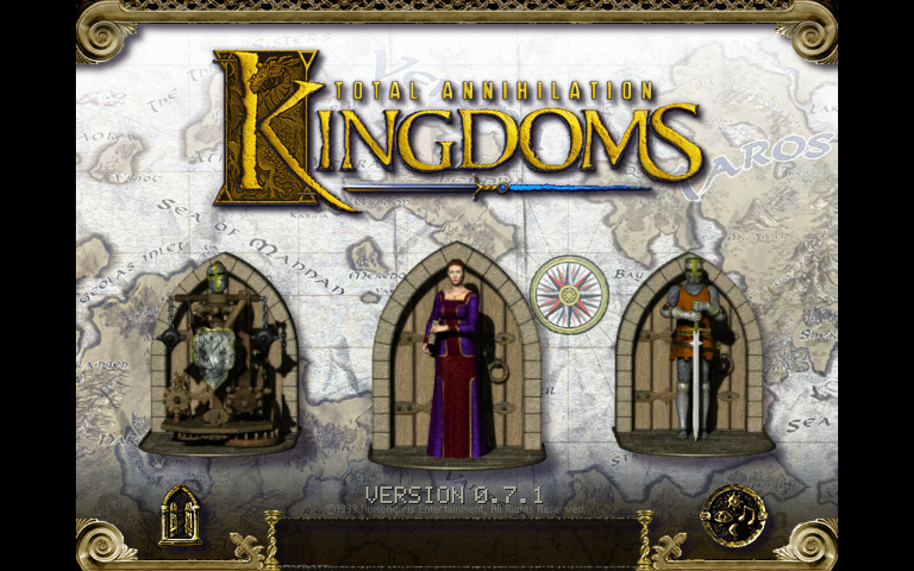
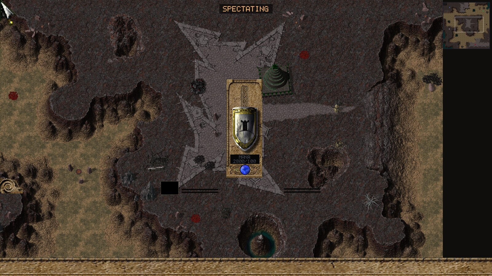
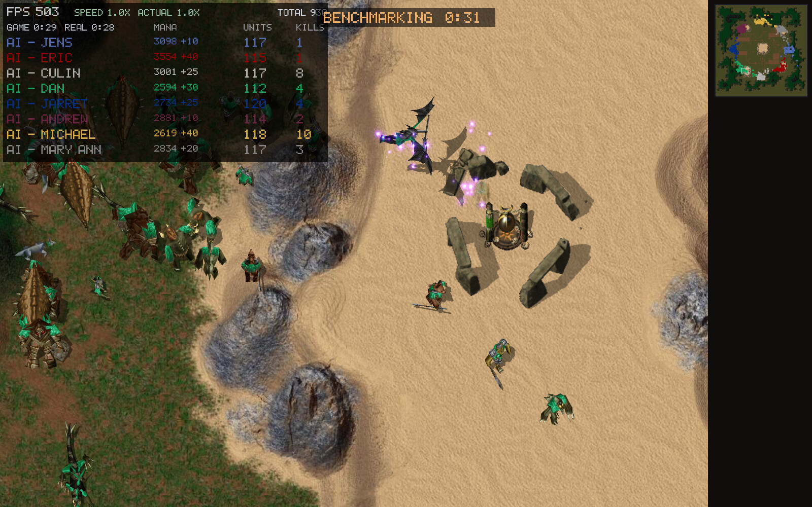
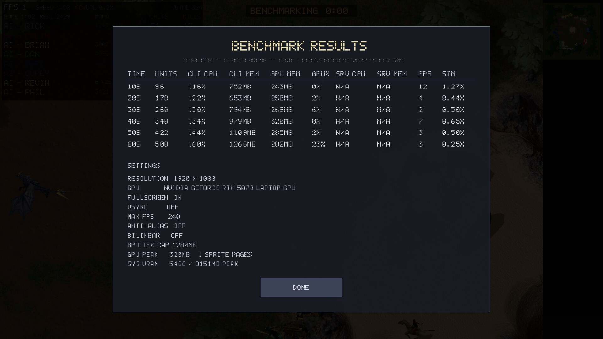
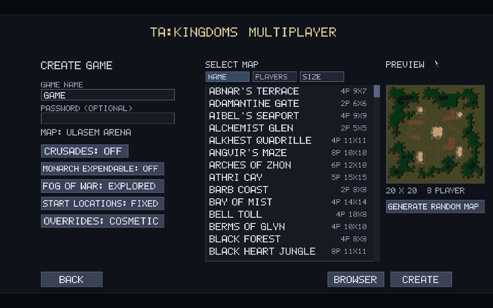
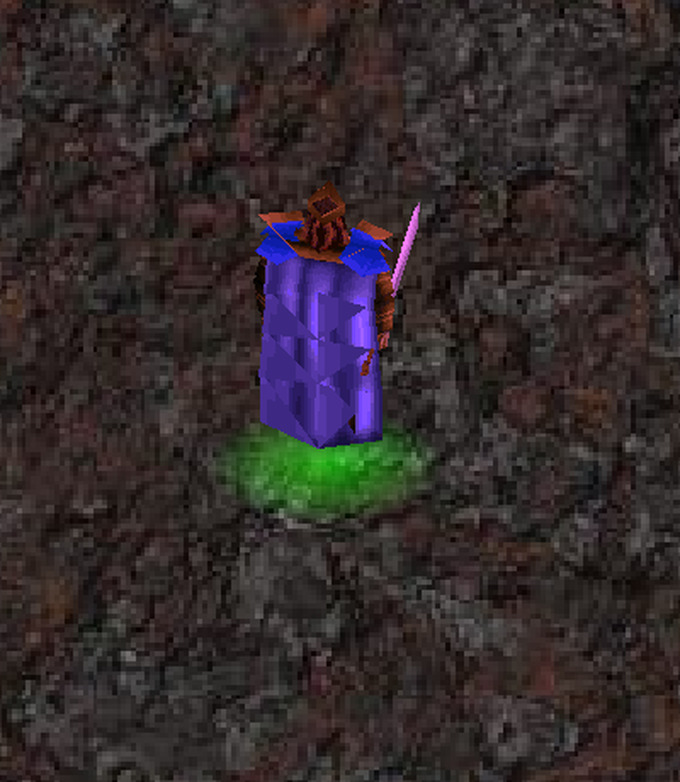
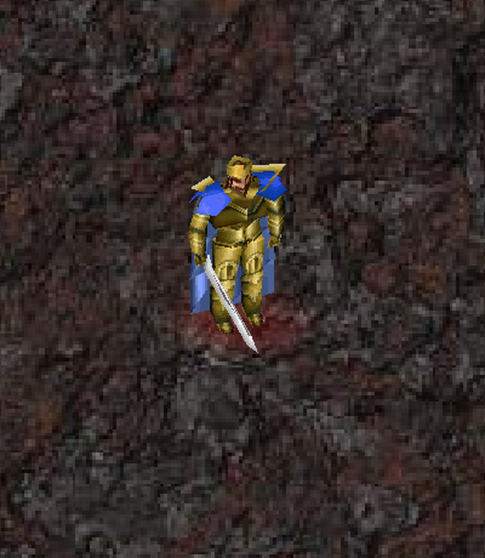

<div align="center">

# ⚔️ TAK Engine

**A modern, cross-platform re-creation of _Total Annihilation: Kingdoms_**

_Cavedog's 1999 fantasy RTS — reborn in clean-room C++20 / SDL2, in the spirit of OpenRA and the Robot War Engine._

[](https://github.com/pocketgeek/tak-engine/releases)
[](CMakeLists.txt)
[](#download)
[](#multiplayer)
[](LICENSE)

<br>



<br><br>

<table>
  <tr>
    <td width="50%"></td>
    <td width="50%"></td>
  </tr>
  <tr>
    <td width="50%"></td>
    <td width="50%"></td>
  </tr>
  <tr>
    <td align="center"><br><em>Monarchs can disco… <code>Shift+D</code></em></td>
    <td align="center"><br><em>…and headbang to synth-metal. <code>Shift+H</code></em></td>
  </tr>
</table>

<sub>Thousands of units on screen · deterministic lockstep MP · animated 3D-model sprites · a full retail-style HUD · a built-in benchmark · and, yes, dancing kings.</sub>

</div>

---

A modern, cross-platform engine recreation for **Total Annihilation: Kingdoms**
(Cavedog Entertainment, 1999), in the spirit of OpenRA and Robot War Engine.

**Version 0.5.6** — reported by `takclient --version` and `takserver --version`
(and shown in the window title / server banner). The release version is set in
one place, `project(... VERSION ...)` in `CMakeLists.txt`, and is separate from
the multiplayer wire protocol version, which is gated independently at connect.

### Download

Latest pre-built binaries (self-contained; you still supply your own retail game
data — see **Game data**):

- **Windows x64** — the `tak-engine-<version>-windows-x64-setup.exe` installer (Start-menu shortcuts + uninstaller), or the plain `takclient-<version>-windows-x64.zip`
- **macOS (Apple Silicon)** — the `tak-engine-<version>-macos-arm64.dmg` disk image (drag *TAK Engine* to Applications; right-click → Open the first time), or the plain `takclient-<version>-macos-arm64.zip`
- **Ubuntu 22.04 / 24.04 / 26.04** — `tak-engine-<version>-ubuntu<rel>-amd64.deb`, then `sudo apt install ./tak-engine-*.deb`
- **Debian 12 / 13** — `tak-engine-<version>-debian<rel>-amd64.deb`, then `sudo apt install ./tak-engine-*.deb`
- **Fedora 44** — `tak-engine-<version>-fedora44-x86_64.rpm`, then `sudo dnf install ./tak-engine-*.rpm`
- **Arch** — `tak-engine-<version>-1-x86_64.pkg.tar.zst`, then `sudo pacman -U ./tak-engine-*.pkg.tar.zst`
- All from the [latest release](https://github.com/pocketgeek/tak-engine/releases/latest) · [all releases](https://github.com/pocketgeek/tak-engine/releases) · or build from source below.

Each release also attaches per-platform **debug** binaries (`*-debug`) — the same
`takclient`/`takserver` *without* the release CLI/env hardening, so developers get the
launch modes, dev flags, `TAK_*` env hooks, and the headless `--mp*` harness.

All of these resolve to the newest [release](https://github.com/pocketgeek/tak-engine/releases);
the `.deb`/`.rpm` packages install `takclient` + `takserver` to `/usr/bin`; SDL2,
libjpeg and zlib are linked **statically** (and the Bink FFmpeg too), so the packages
are self-contained — they pull only base system libraries, nothing extra to install.
They appear once the first tagged release finishes building.

> **This project contains no game content.** You must own the original game
> (e.g. the GOG release of *Total Annihilation: Kingdoms + The Iron Plague*); the
> engine reads its install directory directly (see **Game data**), and any local
> copy of that content stays gitignored.

Much of the behaviour was cross-checked by disassembling the retail engine
(`KINGDOMS.icd`); see `docs/retail-engine.md` for the findings (class model,
config schema, and the veterancy/build formulas read out of the binary).

## Status

Every stage is complete:

1. ~~**Format tooling**~~ — HPI v2, GAF/TAF, TNT, 3DO, COB, TDF/FBI/OTA, GAF
   fonts, WAV all parse.
2. ~~**Asset viewer**~~ — `takclient map` / `takclient model` (textured, COB-animated).
3. ~~**Simulation**~~ — movement, A* pathfinding, combat, mana economy,
   production, per-unit COB VMs, sound.
4. ~~**Skirmish game**~~ — playable vs AI: fog of war, minimap, building
   placement, production, player colours, faction select, a classic HUD, and
   `Keys.TDF` hotkeys.
5. ~~**Campaign**~~ — mission loading via `.ota`/`.cob` with the `MAP_COMMAND`
   scripting API and `.crt` scenario/trigger parsing.
6. ~~**Multiplayer**~~ — client–server deterministic lockstep for up to 8
   players/teams, cross-build deterministic. See [Multiplayer](#multiplayer).
7. ~~**Combat & unit depth**~~ — the FBI/weapon data is driven faithfully: HP
   regen, veterancy (kills → +10 %/level attack·armour·reload, gold sheen,
   promoted `veteranmodel`), per-unit mana pools & mana-per-shot, area-of-effect
   splash + per-target-category damage, status weapons (freeze / petrify /
   paralyze) with immunities, cloaking, reclaim / resurrect /
   capture, `AdjustArmor`/`AdjustAttack` auras, terrain-class movement
   (`MOVEINFO.tdf` slope/water limits + water/road speed), radar sight,
   line-of-sight firing, flow-field group movement, and a summonable-god economy.
8. ~~**Effects & audio**~~ — real GAF/TAF explosion, splash, shockwave-ring,
   ground-fire and muzzle-flash effects; material-specific impact sounds; unit
   shadows; camera shake; positional/surround audio.
9. ~~**Rendering at scale**~~ — thousands of units on screen, smoothly. The
   per-unit model projection runs across a worker pool; units are frustum-culled;
   each colour's textures are packed into one atlas so an army is a handful of
   draw calls; and each unit's walk/fly cycle is baked to an **animated sprite
   sheet** (16 facings, real cycle timing) drawn as a single quad — the classic
   RTS trick — with the full 3D model kept for close-ups and attack/death poses.
   The sim is O(n) (spatial-hash neighbour queries, staggered acquisition, parallel
   flow-field building, crowd-adaptive work caps), so even battles of tens of
   thousands of units stay tractable. GPU texture memory is bounded by a
   **self-calibrating VRAM budget** (LRU-evicting sprite atlas pages, terrain
   working-set eviction, AA that steps down under pressure — it tightens itself
   the moment an allocation fails), so a giant scene can't exhaust the card; and
   terrain is **streamed** in chunks over a low-res overview, so map tiles never
   flash in as black squares.

## Building

Requires CMake ≥ 3.24, a C++20 compiler, and Ninja. SDL2 must be present on the
system (e.g. `SDL2-devel` / `libsdl2-dev`); if it's missing the client is skipped
with a warning and only the headless tools + server build.

```sh
cmake -B build -G Ninja
cmake --build build
```

### Menu door videos (Bink/FFmpeg)

The animated front-end door clips are Bink1 (`.bik`) video, decoded through
FFmpeg. **The downloaded releases need no FFmpeg installed** — every shipped
package (`.rpm`/`.deb`/zips, all three platforms) links a minimal, Bink-only
FFmpeg **statically into `takclient`**, so the door videos just play on a stock
system with nothing to install. It stays optional either way: with no FFmpeg
decoder at all, the doors fall back to their static GAF art.

Building from source, pick one:

- **Bundled static FFmpeg (`-DTAK_STATIC_FFMPEG=ON`) — what the releases use.**
  Build the minimal Bink-only FFmpeg once and link it *into* the binary, so it
  decodes the door videos with **no runtime FFmpeg at all**:

  ```sh
  ./tools/build-ffmpeg-bink.sh           # -> third_party/ffmpeg-bink (static, ~+1 MB)
  cmake -B build -G Ninja -DTAK_STATIC_FFMPEG=ON
  cmake --build build
  ```

  The Bink path is pure LGPL (no GPL codecs pulled in). `TAK_FFMPEG_PREFIX`
  overrides where the static install lives.

- **System FFmpeg (the plain-`cmake` default, without that flag).** Configure
  finds `libavcodec`/`libavformat`/… via `pkg-config` and links them dynamically.
  The catch: the build's `libavcodec` must actually contain the Bink decoder.
  Stock Fedora's `libavcodec-free` does **not**; install RPM Fusion's `ffmpeg`
  (or `libavcodec-freeworld`) for it.

### Cross-platform builds

The engine builds for **Linux**, **Windows 11 (x64)**, and **macOS (Apple
Silicon / ARM64)** from one source tree — the net layer abstracts POSIX sockets
vs Winsock in `src/net/netcompat.h`, and process launch is the only other
platform split (`fork`/`exec` vs `CreateProcess`, in `src/client/main.cpp`).

- **Windows, cross-compiled from Fedora** with MinGW-w64:

  ```sh
  sudo dnf install mingw64-gcc-c++ mingw64-SDL2 mingw64-zlib mingw64-libjpeg-turbo
  mingw64-cmake -B build-win -G Ninja -DBUILD_SHARED_LIBS=OFF
  cmake --build build-win
  ```

  The GCC/C++ runtime is static-linked, so a Windows box needs only the exes plus
  `SDL2.dll`, `libjpeg-62.dll`, and `zlib1.dll` (from the mingw sysroot `bin/`)
  in the same folder.

- **macOS ARM64** (on a Mac): `brew install ninja sdl2 jpeg-turbo`, then
  `cmake -B build -G Ninja` and `cmake --build build`.

CI (`.github/workflows/`) splits per-commit checks from release builds.
`determinism.yml` runs on every `main` push (sim changes) as the fast lockstep
gate. The platform builds — `windows.yml` (MSYS2/MinGW), `macos.yml` (native
`macos-14`), and `linux.yml` (`.deb` on Ubuntu, `.rpm` in a Fedora container) —
run **only on a version-bump tag** (`v*`): each builds and attaches its artifact to
the GitHub Release, and the Windows and macOS builds additionally run the
cross-platform determinism gate. Cutting a release is just
`git tag vX.Y.Z && git push origin vX.Y.Z` (bump `project(... VERSION ...)` first).

## Game data

Point the engine straight at a **retail install directory** — no extraction
step. Pass it with `--data`, or just launch `takclient` with no arguments: it
pops up a **native folder picker** ("choose your TA:Kingdoms install"), checks
the folder actually holds the game data, and **remembers it** (saved in config,
re-validated each launch) so you're only asked once. It reads the shipped
archives and folders in place:

```
<install>/
  *.hpi              the shipped archives (data, terrain, maps, sections,
                     english, the IP* Iron Plague expansion, community packs…)
  Maps/              downloadable maps as *.kmp (each an HPI) + loose maps
  Music/             track*.wav soundtrack
  overrides/         YOUR overrides -- loose files or *.hpi/*.kmp, highest priority
```

Only the **canonical** retail archives in the install root are read — the base
game, the Iron Plague expansion (`IP*.hpi`), and the official map/rocket packs;
any other `*.hpi` dropped in the root (and all loose files there) is ignored. Maps
come from `maps.hpi` and the `Maps/*.kmp`, music from `Music/`, and anything in
`overrides/` wins over everything. A small **authenticity manifest** of those root
archives is recorded with the folder and recomputed each launch; a moved or
unreadable install re-opens the folder picker.

**HPI precedence.** The retail game shipped each update as a new HPI/UFO that
superseded older copies of a file, and the engine reproduces the exact rule
(reverse-engineered from `KINGDOMS.icd`): a loose file wins; otherwise, across all
`*.hpi` then `*.ufo`, the copy whose archive entry has the **newest date** wins
(ties keep the earlier-mounted). So dropping a newer patch archive (e.g.
`V3Rocket.hpi`) into the install Just Works. `hpitool where <dir> <path>` shows
which archive a file resolves to; the offline `hpitool merge` still bakes a flat
tree if you want one.

## Playing

The engine is **client-server only** — every game runs on a `takserver`, and the
AI runs *only* on the server. Single-player is just a private game on a server the
client starts for you.

Point it at your install and it opens the retail **front-end menu**:

```sh
./build/takclient --data /path/to/tak_install
```

From the three doors you pick **Single-Player**, **Multiplayer**, or **Campaign**,
then choose the map, your faction and colour, teams, and — for each AI opponent — one
of five **difficulty levels** in the lobby:

| Difficulty | Behaviour |
| --- | --- |
| **Passive** | turtles and only *defends* — builds an army but never marches out |
| **Easy** | slow to build up; no harassment, then commits a single army late |
| **Normal** | harasses with small **raiding parties** while massing a main army sized to its mana income |
| **Hard** | reacts fast; raids early, but **holds its big attack** until it has a large army relative to its income |
| **Absurd** | Hard, plus **double mana income** from every source — an economic juggernaut (so its army threshold is huge) |

From **Normal** up the AI doesn't trickle units in: it peels off a few for **raids**
to pressure and scout, and holds the main force back until it's massed a decisive army
scaled to its mana income, then commits it — re-mustering the next wave afterward.
(Easy skips the raids and just gathers one army.)

Each side begins with **only its Monarch**, dropped on the map's real start positions
(from the `.ota`). The Monarch trickles mogrium and builds the first lodestones and
keep, which then train the army — the AI opponent bootstraps the same way, following a
needs-based build plan (economy → a factory → army). In a god-enabled match, a faction
whose priests (`attractsgods` units) have channelled enough mana favour manifests its
**god** once the appear time passes.

Audio (master / music / SFX volumes + per-speaker trim), display, camera, and
rendering preferences — anti-aliasing, **bilinear filtering** (retail's
smooth-scaling video option), the distance-impostor **LOD**, the **unit-sprite**
mode, **health bars** (off / damaged / always), and the **build-menu alignment**
(left / center / right) and **scale** — are set in the in-game **Options** screen
(Esc → Options) and persisted per user.

**Benchmark.** *Settings → Benchmark* runs a fixed, deterministic 8-AI
free-for-all on Ulasem Arena at a chosen **intensity** — Low to *Extra Absurd*,
spawning one unit per faction every 1 s, 0.5 s, 0.25 s, 0.125 s, 0.0625 s, or
0.03125 s — for 60 s, then shows a **stats screen** with, at each 10 s mark, the
client and server **CPU %, memory, frame rate, sim speed**, plus **GPU
utilisation, texture VRAM and device VRAM** and the display settings that
produced them. A repeatable load test that stresses the sim and renderer at
scale.

### Command line

A **release** build is deliberately minimal — it accepts only:

| Flag | Effect |
| --- | --- |
| `--data <retail-install-dir>` | the game-data root (root `*.hpi` + `Maps/` + `Music/` + `overrides/`). **Optional** — with no `--data`, the client re-uses the folder saved in config, or pops the folder picker on first run (see **Game data**) |
| `--version` | print the version and exit (`--help` prints this usage) |

So a release `takclient` needs **no arguments at all** to launch. Everything else —
the data folder, factions, colours, difficulty, the map, multiplayer, overrides — is
handled by the first-run picker and the menu, and a release build reads **no
environment variables**.

**Debug builds** additionally accept the launch modes `game <map>` / `map <map>` /
`replay <file.takrep>` / `model <file.3do>` and the dev/test flags (`--side`,
`--aiside`, `--server`, `--overrides {none,cosmetic,full}`, `--crusades`, `--cheat`,
`--demo`, `--mission`, `--campaign`, `--maxfps`, `--novsync`, the `--mp*` headless
harness, …) plus the `TAK_*` diagnostic env vars. Run a debug `--help` for the full
list. `--overrides` defaults to `full` (a release build always mounts `full`):
`none` = pure retail, `cosmetic` = only art/sound/music, `full` = everything including
gameplay data.

### Controls

Default hotkeys follow the game's `Keys.TDF`; every in-game command / selection /
emote key is **rebindable** in the **Esc / Settings menu → CONTROLS** (click a
row, press the new key; right-click clears).

| | |
| --- | --- |
| **Select** | drag = box-select · **Ctrl+A** all your units · **Ctrl+Z** all of that type · **Ctrl+U** everything on screen · **N** cycle to next unit |
| **Order** | right-click = move/attack (**Shift** queues) · **F** fight-move · **M** move · **A** attack · **P** patrol · **G** guard · **S** stop · **Ctrl+D** destroy · **Esc** cancel an armed order |
| **Groups & formations** | **Ctrl+1–0** assign a group · **Alt+1–0** assign a **formation** · **1–0** recall · **+Shift** appends · **Ctrl+Esc** leave. A unit is in one squad at a time, and a number is a group *or* a formation. A **formation** moves at its slowest member's speed and its stragglers rejoin. Each unit shows its squad under it (`3` = group 3, `3F` = formation 3). Recalling a squad skips its builders — a builder rides along only so anything it builds auto-joins the squad. |
| **Camera** | arrows / middle-drag / **screen-edge** scroll · wheel zoom (toward cursor) · minimap click/drag = move the camera · right-click minimap = move the selection there |
| **Minimap orders** | with an order armed (**F**/**M**/**A**/**P**/**G**), click the minimap to issue it at that spot — e.g. **F** then a minimap click = fight-move across the map |
| **Build queue** | at a training building: left-click **+1**, **Shift** **+5**, **Ctrl+Shift** **+10**; right-click removes the same; **Ctrl**+left toggles infinite production. Each icon shows its queued count. (A builder that *places* things — structures, or a mobile conjurer like a Beast Handler — arms placement instead: click to position.) |
| **Reclaim** | with a mobile builder (any unit with `canreclaim`, monarchs included) selected, **right-click-drag** a box to clear it — the builder roams the area reclaiming trees, rocks, and buildings for mana (nearest first). Sacred Stones and Standing Stones are left alone. **Shift** appends the sweep to its orders. |
| **Game** | **Pause** · **+/−** game speed (single-player: −10…+10, 0 = normal, +10 = 10×; in a net game only the **host** can change it, and only if the lobby's *in-game speed* is unlocked) · **F4** status/scoreboard |
| **Disco** 🪩 | **Shift+D** — your monarchs spin, bob, hue-cycle, and glow on a little dance floor for 10s, to a synthesised disco track that plays positionally from the monarch. Purely cosmetic, but synced over the lockstep so every player sees it. |
| **Headbang** 🤘 | **Shift+H** — your monarchs headbang to a synthesised heavy-metal track (positional, from the monarch), nodding and flashing red on a mosh-pit glow for 10s. Also cosmetic and lockstep-synced. |

Rendering keeps full 3D models until a real crowd can't hold 60 fps, then drops to
cheaper animated sprites and back to 3D as the crowd clears; distant units use a cached
billboard **LOD**. Both are automatic by default and adjustable in **Options** (*Unit
Sprites* AUTO/ON/OFF, *Distant Impostors* on/off). Background music plays from the
faction soundtrack.

## Multiplayer

Multiplayer is **client–server**: everyone connects out to one central
`takserver`, so there's no NAT or port-forwarding on the players' side. The
server relays a **server-sequenced deterministic lockstep** — up to 8 players on
up to 8 teams (allies share vision and economy), every machine running the
identical sim with only ~35-byte commands on the wire.

```sh
# somewhere reachable (default port 7677):
./build/takserver --port 7677 --data /path/to/tak_install

# each player — launch the client and join through the menu's Multiplayer door
# (enter the server's host[:port] there, then browse/create/join in the lobby):
./build/takclient --data /path/to/tak_install
```

(A debug build can also connect straight from the command line, skipping the menu:
`takclient game "<map>" --data <dir> --server <host> [--serverport N] [--name X]`.)

- **Referee sim.** With `--data`, the server also runs a referee simulation that
  hosts the AI players (so no host machine is loaded by them) and holds the
  canonical state hash every client is checked against. Without `--data` it's a
  pure relay and clients cross-check hashes among themselves. A server hosting
  several games at once ticks their sims **in parallel** across CPU cores (games
  are independent), while a single game keeps its intra-tick worker parallelism.
- **Game-data agreement.** Every peer fingerprints the gameplay data its sim will
  read (`hpi::gameplayHash`: unit/weapon/side/build/feature files, never maps or
  cosmetics) and sends it in the handshake. The server rejects anyone whose
  fingerprint differs from the referee's -- so a modified retail file, or a
  `full`-tier gameplay override not shared by everyone, is caught at join instead
  of desyncing mid-game. Cosmetic (`cosmetic`-tier) overrides don't change the
  fingerprint, so players can keep their own art and sound.
- **Lobby.** The in-client lobby has a game browser, a create-game dialog
  (name/password/map; **crusades**, **gods**, and **Monarch Expendable** toggles),
  and a room where each player picks faction, colour, and team and readies up; the
  host opens/closes slots, kicks, and starts. **Monarch Expendable** is the loss
  rule: *off* (the retail commander rule) means losing your Monarch loses you the
  game even if other units survive; *on* makes the Monarch just another unit. The
  host also sets the **unit cap** — the per-player live-unit limit (250 / 500 /
  1000 / 2000 / 5000, default 2000; production and new builds stall a player once
  they reach it) — and can **allow in-game speed changes** so the host's **+/−**
  keys re-cadence the match live (0.5×–4×). Speed only changes how fast ticks
  happen in wall-clock — the per-tick `dt` is fixed — so the sim stays bit-identical
  and deterministic.
- **Cross-build determinism.** The sim's trig is routed through a
  deterministic-math shim (`src/sim/detmath`), so lockstep holds across
  compilers and CPUs, not just the same binary. Everyone still needs the same
  engine build and game data (the handshake gates the protocol version).
- **Reconnect & forfeit.** A dropped player's slot is held; they can rejoin with
  a resume token (the client replays the bundle log to catch up). Otherwise they
  forfeit deterministically.
- **Spectate.** A running game can be **watched live** from the browser (the
  **WATCH** button): the spectator replays the bundle log to the present, then
  follows along with no fog, no control, and a radar that shows every unit.
  Single-player has its own spectate mode too — flip **SPECTATE (WATCH AIS)** in
  the SP lobby and every slot fills with a random-faction AI to just watch them
  fight (there's even a **STRESS TEST** toggle that starts each AI at ~95 % of the
  unit cap, for load-testing the sim).

See `docs/multiplayer-design.md` for the full design, and `docs/detmath-scope.md`
for the determinism contract. (The old 2-player `--host`/`--join` peer mode is
retired.)

## Replays

Start the server with `--replaydir <dir>` and it writes a self-contained
`.takrep` for every finished game. Play one back as a spectator:

```sh
./build-dbg/takclient replay <file.takrep> --data /path/to/tak_install
```

**Pause** and the **+/−** speed keys scrub it; a bar shows elapsed / total time. (The
`replay` launch mode is a debug-build feature — a release build accepts only `--data`.)

## Overrides

Anything in the install's `overrides/` folder -- loose files or `*.hpi`/`*.kmp`
archives -- overrides the shipped data, exactly like the original game. For
example a `overrides/click.hpi` holding `sounds/*.wav` replaces the faction
order-acknowledgement tones. Overrides are classified as **cosmetic** (art,
models, animation, sound, music, fonts, GUI) or **gameplay** (unit/weapon/side/
build/feature data, maps). A release build always mounts **`full`** (everything);
a debug build can restrict it with `--overrides {none,cosmetic,full}` (`cosmetic`
mounts only the art/sound tier). Cosmetic overrides never affect a multiplayer game
and can differ between players; gameplay overrides (the `full` tier) change the data
fingerprint, so under `full` every player must share the same ones.

## Project layout

| Path | Contents |
| --- | --- |
| `src/hpi/` | HPI archive reader (TAK's revised format vs. classic TA) |
| `src/gaf/` | GAF/TAF sprite, animation, and font decoding |
| `src/video/` | `.bik` (Bink Video) decoding for the menu door clips (FFmpeg-backed) |
| `src/tnt/` | TNT map decoding |
| `src/tdo/` | 3DO model loading |
| `src/cob/` | COB script bytecode VM (unit animation/scripting) |
| `src/tdf/` | TDF/FBI/OTA text-config parsing |
| `src/crt/` | `.crt` scenario/trigger parsing |
| `src/campaign/` | campaign spine (`camps/*.tdf`) + in-sim mission/god-script runner |
| `src/sim/` | deterministic simulation (movement, A* pathing, combat, economy) |
| `src/net/` | multiplayer wire format, framed TCP, client protocol |
| `src/server/` | `takserver`, the headless lobby + lockstep relay |
| `src/ai/` | the skirmish AI (server-portable; emits commands) |
| `src/terrain/` | terrain / palette handling |
| `src/util/` | shared helpers |
| `src/gui/` | retail `.gui` HUD/gadget layout parsing |
| `src/client/` | the SDL2 app (`takclient`: asset viewer + game) |
| `tools/` | CLI dev tools (`hpitool`, `gaftool`, `tnttool`, `modeltool`, `cobtool`, `tdftool`, `missiontool`, `biktool`, `aitool`) |
| `docs/` | format notes + reverse-engineering findings (`retail-engine.md` = the `KINGDOMS.icd` disassembly) |

## License

TAK Engine is free software, licensed under the **GNU General Public License,
version 3 or later** (`GPL-3.0-or-later`) — see [`LICENSE`](LICENSE) for the full
text. Copyright © 2026 the TAK Engine authors.

This covers the engine's own source code only. It grants no rights to *Total
Annihilation: Kingdoms* itself: Cavedog's game code, data, and art remain their
owners' property; this project ships none of them and reads them only from a copy
you already own (see **Game data**).
