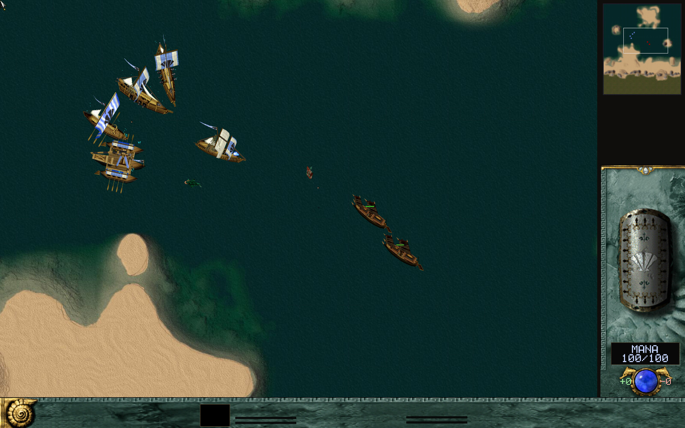
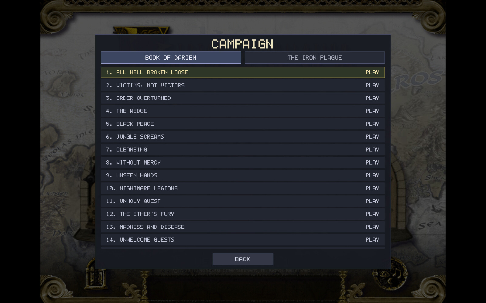

<div align="center">

# TAK Engine

**Play Total Annihilation: Kingdoms on modern systems.**

A clean-room C++20 / SDL2 recreation of Cavedog's 1999 fantasy RTS.

[](https://github.com/pocketgeek/tak-engine/releases)
[](#download)
[](LICENSE)

[Download](https://github.com/pocketgeek/tak-engine/releases/latest) · [Getting started](#getting-started) · [User guide](docs/user-guide.md) · [Build from source](docs/development.md)

<a href="docs/img/title.jpg"></a>

<table>
  <tr>
    <td width="50%"><a href="docs/img/gameplay.jpg"></a><br><sub>Zhon forces on Ulasem Arena</sub></td>
    <td width="50%"><a href="docs/img/naval.jpg"></a><br><sub>Naval combat on Cairbray Coast Landing</sub></td>
  </tr>
  <tr>
    <td width="50%"><a href="docs/img/lobby.jpg"></a><br><sub>Maps and match setup</sub></td>
    <td width="50%"><a href="docs/img/campaign.jpg"></a><br><sub>Campaign selection</sub></td>
  </tr>
</table>

<sub>Captured in v0.7.1. Army view: built-in benchmark. Naval view: development demo.</sub>

</div>

Command Aramon, Taros, Veruna, Zhon, or Creon in skirmishes, campaigns, and
multiplayer. The engine reads your original game's maps, models, scripts,
interface art, and sound directly from its installation.

**You need your own copy of Total Annihilation: Kingdoms.** No retail game
assets are included. An installation of *Kingdoms + The Iron Plague*, such as
the GOG edition, supplies the game data.

## Download

Get **version 0.7.1** from the [latest release](https://github.com/pocketgeek/tak-engine/releases/latest).
Choose the package for your system:

| System | Package |
| --- | --- |
| Windows x64 | `windows-x64-setup.exe` installer, or the portable ZIP |
| macOS Apple Silicon | `macos-arm64.dmg`; drag **TAK Engine** to Applications |
| Ubuntu 22.04 / 24.04 / 26.04 | Matching `ubuntu…-amd64.deb` |
| Debian 12 / 13 | Matching `debian…-amd64.deb` |
| Fedora 44 | `fedora44-x86_64.rpm` |
| Arch Linux | `x86_64.pkg.tar.zst` |

Release filenames also include the project name and version. Install Linux
packages with `apt install ./…deb`, `dnf install ./…rpm`, or `pacman -U ./…pkg.tar.zst`
using administrator privileges. Linux packages include the client, dedicated
server, and Cartographer map editor.

Game libraries are bundled; your system still provides windowing, audio, and
graphics support. On macOS, right-click → **Open** on the first launch if needed.
For the ZIP, launch **TAK Engine.app**, rather than its internal executable.
The `-debug` downloads are for diagnostics and development.

## Getting started

1. Install or unpack TAK Engine.
2. Launch **TAK Engine** and choose your original game's installation folder
   when prompted. Select the folder containing the retail `.hpi` archives;
   no extraction is needed. The engine remembers this location.
3. Choose the single-player door for a skirmish, multiplayer to join a server,
   or campaign to browse the missions.
4. Pick your map, faction, opponents, and balance settings, then start playing.

You can also supply the data folder explicitly:

```sh
takclient --data /path/to/tak_install
```

Release builds otherwise use the menus; `--version` prints the installed
version. Custom maps belong in the installation's `Maps/` folder, and custom
content belongs in `overrides/`. Unknown archives dropped into the installation
root are not loaded. See the [game-data guide](docs/user-guide.md#game-data)
for layout, archive precedence, and troubleshooting a rejected folder.

## What you can play

- **Skirmish:** up to eight slots, five factions, teams, generated maps,
  retail or Crusades balance, and five AI difficulty levels.
- **Multiplayer:** hosted games, shared allied vision, spectators, reconnects,
  and a server referee running the same deterministic simulation as the clients.
- **Campaigns and scenarios:** mission scripts and scenario triggers, using
  the original game data. Individual missions remain subject to ongoing fixes.
- **Replays:** open recorded matches through **Settings → Load Replay**.
- **Map editing:** Cartographer creates and edits terrain, objects, start
  positions, and scenario rules, and exports `.kmp` map bundles.

Each ordinary skirmish starts with your Monarch. Build your economy and army;
Zhon's mobile conjurers replace the conventional keep-based production chain.
Unless **Monarch Expendable** is enabled, losing your Monarch loses the game.
The lobby supports a maximum of **2,000 live units per player**.

| AI | What to expect |
| --- | --- |
| Passive | Builds a defensive force at home; sends no attacks |
| Easy | Builds slowly and gathers an army before attacking |
| Normal | Sends probing raids while saving a larger attacking force |
| Hard | Expands more aggressively, with raids and larger attack waves |
| Absurd | Hard behavior with double mana income, including reclaim |

The AI considers income and available terrain when building its force.
[The user guide](docs/user-guide.md#playing) explains standing orders,
production queues, match options, and AI behavior in more detail.

## Controls

These are the engine's default bindings. Command, selection, view, and emote
bindings can be changed in **Settings → Controls** (click a row and press a
new key; right-click clears it). Number-key squads, **Esc**, chat, pause, and
speed controls are fixed. Orders requiring a target are armed by the key and
issued with a left-click; **Shift** queues the order.

### Orders and unit actions

| Key | Action |
| --- | --- |
| **M** | Move |
| **A** | Attack |
| **F** | Fight-move |
| **P** | Patrol |
| **G** | Guard |
| **H** | Heal / repair a friendly unit |
| **L** / **U** | Load a passenger / unload at a destination |
| **S** / **C** | Stop / clear orders; both clear the selected units' queues |
| **W** | Cycle the active weapon of a selected unit with multiple weapons |
| **K** | Toggle cloak for selected units that can cloak |
| **O** | Open / close selected gates |
| **Ctrl+Shift+D** | Toggle self-destruct for selected units; press again to cancel |

### Selection

These shortcuts select your own units. Category selections replace the current
selection. **N** requires a current selection to cycle from.

| Key | Select |
| --- | --- |
| **Ctrl+A** | All your units |
| **Ctrl+Z** | All units of every type in the current selection |
| **Ctrl+U** | All your units on screen |
| **Ctrl+X** | On-screen units matching the first selected unit's type |
| **Ctrl+M** | Your monarch, and follow it with the camera |
| **Ctrl+B** | Builders, including builder structures |
| **Ctrl+F** | Factories / builder structures |
| **Ctrl+E** | Mobile melee units |
| **Ctrl+G** | Mobile magic users with a personal mana pool |
| **Ctrl+N** | Boats / water-domain units |
| **Ctrl+R** | Units with ballistic weapons |
| **Ctrl+T** | Armed mobile troops, excluding boats and monarchs |
| **Ctrl+W** | Armed units, excluding monarchs |
| **Ctrl+Y** | Flying units |
| **N** | Next unit |

### Groups and formations

| Key | Action |
| --- | --- |
| **Ctrl+1–0** | Assign the selection to a group |
| **Alt+1–0** | Assign the selection to a formation |
| **Ctrl+Shift+1–0** / **Alt+Shift+1–0** | Append to a group / formation |
| **1–0** | Recall the group or formation; **0** is squad 10 |
| **Ctrl+Esc** | Remove selected units from their squads |

A unit belongs to one squad at a time. Each number holds either a group or a
formation; formations move at their slowest member's speed. Recall skips
builders, but units they produce inherit their squad.

### Camera, information, and game controls

| Key | Action |
| --- | --- |
| **Arrow keys** | Pan the camera |
| **T** | Toggle camera tracking of the selection |
| **Tab** | Toggle the full-screen map; press again to return |
| **F1** | Toggle unit information |
| **F4** | Toggle unit counts / status |
| **O**, with no units selected | Toggle campaign objectives when available |
| **Pause** | Pause / resume the game or replay |
| **+** / **−** (also **=** and keypad **+/−**) | Change game / replay speed |
| **Enter** (also keypad Enter) | Open chat; press again to send; **Esc** cancels |
| **Esc** | Close unit information, cancel placement / an armed order, clear selection, then open the game menu as applicable |
| **Shift+D** | Monarch disco emote |
| **Shift+H** | Monarch headbang emote |

Live game speed ranges from 0.5× to 4×. Only the host can change it, and the
lobby's in-game speed option must be unlocked. Chat is available in live
networked games (single-player also uses a local server), not replay playback.

### Mouse and construction

| Input | Action |
| --- | --- |
| **Left-click / left-drag** | Select a unit / box-select |
| **Shift** + selection | Add to the selection |
| **Ctrl** + selection | Remove from the selection |
| **Right-click** | Contextual move, attack, or other applicable order; **Shift** queues |
| **Middle-drag / screen edges** | Pan the camera |
| **Mouse wheel** | Zoom toward the cursor |
| **Minimap left-click / drag** | Move the camera; an armed order instead targets that location |
| **Minimap right-click** | Move the selection there; **Shift** queues |
| **Build icon left-click / right-click** | Add / remove one queued unit at a training building |
| **Shift** / **Ctrl+Shift** + build-icon click | Add or remove five / ten queued units |
| **Ctrl+left-click** a build icon | Start infinite production; toggle it at stationary producers |
| **Left-click** while placing | Place the construction site |
| **Shift+left-click / drag** while placing | Queue a site / a line of sites |
| **Right-click / Esc** while placing | Cancel placement |
| **Right-drag** with a reclaim-capable mobile builder | Reclaim an area; **Shift** appends the sweep |

Mobile builders use build icons to arm placement instead of ordinary factory
queues. A mobile builder producing an infinite queue accepts only **Stop**
until that queue is cleared. See the [user guide](docs/user-guide.md#controls)
for construction and reclaim details.

## Multiplayer and replays

Choose a server through the multiplayer menu, sign in, then create or join a
game. An unused account name is registered on first sign-in. Players connect
to the server; only the server needs an incoming network port available.
Single-player starts its own private server automatically.

Use the **same engine build and compatible game data** on every participant.
Released **0.7.1 uses protocol 179**; current development builds use **181**
for corrected naval building placement and full-yard map bounds. These builds
cannot mix in a match.
Version 0.7.0 uses 177. Older incompatible clients and recordings are rejected.
The connection checks gameplay definitions, but
that fingerprint does not cover every file: keep gameplay overrides, scripts,
models, and maps compatible too.

Clients record matches in their per-user application data directory beside
`settings.ini`. Replays contain commands and match setup, not game assets.
[Hosting and accounts](docs/user-guide.md#multiplayer) and
[replay playback](docs/user-guide.md#replays) are covered in the user guide.

## Display and performance

Use **Options** to adjust audio, anti-aliasing, filtering, shadows, health bars,
UI scale, cursor size, and camera behavior. **Smooth GUI Art** requires a restart;
**Smooth Movies** smooths the menu clips as they play.

The shadow option controls unit, scenery, and projectile shadows. Shadows follow
animated poses, including swaying trees; shading baked into terrain artwork
remains visible. Version 0.7.1 uses per-unit shadow silhouettes on supported
accelerated renderers, with a fallback for unsupported or exhausted targets.
Development builds after 0.7.1 also add boat shadows, an intentional enhancement
over retail Glide, controlled by the same Shadows option.

**Settings → Benchmark** provides a repeatable eight-AI load test and reports
frame rate, simulation speed, memory, and other available performance metrics.
Testing targets up to **16,000 total units**, not a guarantee of real-time play
at that population. Map, unit mix, orders, hardware, and graphics settings all
matter. See the [latest profiling results](docs/performance-2026-09-26.md) and
[earlier performance notes](docs/performance-2026-09-20.md).

## Project status

TAK Engine is playable and under active development. The aim is an accurate
representation of retail behavior; this is not a claim that every mission,
animation, or interaction is identical or fully verified.

Selected movement, combat, transport, scripting, and animation routines are
checked against the original executable through headless emulation. Ground
pathfinding parity is a continuing constraint on engine changes. The skirmish
AI is this project's implementation, rather than a reproduction of retail AI.

For the evidence and remaining scope, see the [retail engine notes](docs/retail-engine.md),
[pathfinding work](docs/pathfinding-port.md),
[transport and animation audit](docs/transport-animation-audit-2026-09-21.md), and
[naval building placement correction](docs/naval-building-placement.md).

## Build and contribute

Source builds use C++20, CMake, and the bundled static dependency builds.
Start with the [development guide](docs/development.md) for dependencies,
platform instructions, tests, developer launch modes, and release packaging.
After simulation, AI, or networking changes, rebuild all targets so client
and server remain in sync.

Bug reports are most useful with the engine version, platform, map, balance
setting, steps to reproduce, and a replay or screenshot where relevant.
Do not attach retail game archives or executables.

## License

The engine is **GPL-3.0-or-later**; see [LICENSE](LICENSE).
The original game's code, data, and art remain their owners' property.
This repository distributes engine source, not the retail game content.
