<div align="center">

# TAK Engine

**Play Total Annihilation: Kingdoms on modern systems.**

A clean-room C++20 / SDL2 recreation of Cavedog's 1999 fantasy RTS.

[](https://github.com/pocketgeek/tak-engine/releases)
[](#download)
[](LICENSE)

[Download](https://github.com/pocketgeek/tak-engine/releases/latest) · [Getting started](#getting-started) · [User guide](docs/user-guide.md) · [Build from source](docs/development.md)

<a href="docs/img/title.jpg">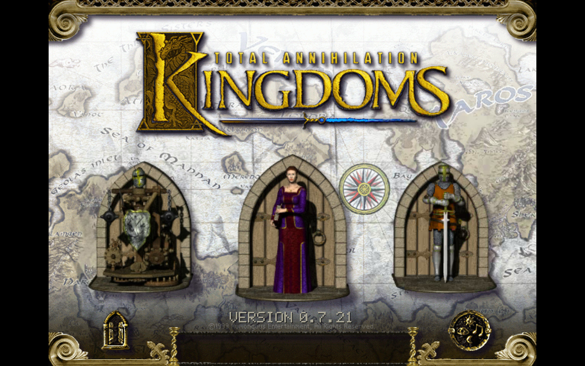</a>

<table>
  <tr>
    <td colspan="2"><a href="docs/img/army.jpg">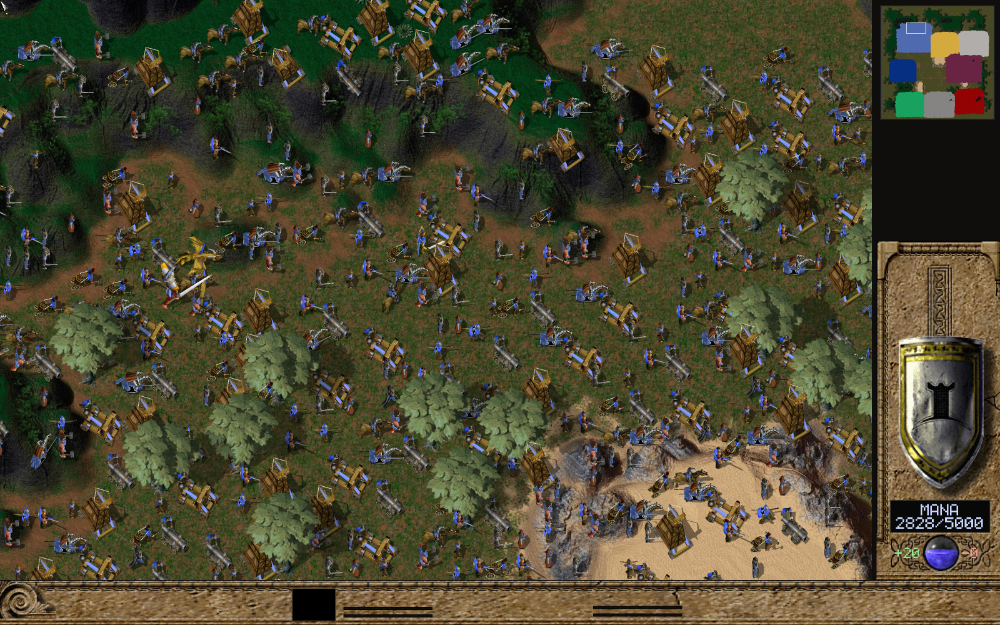</a><br><sub>A large Aramon force — 16,000-unit development stress scene, showing part of one army</sub></td>
  </tr>
  <tr>
    <td width="50%"><a href="docs/img/gameplay.jpg">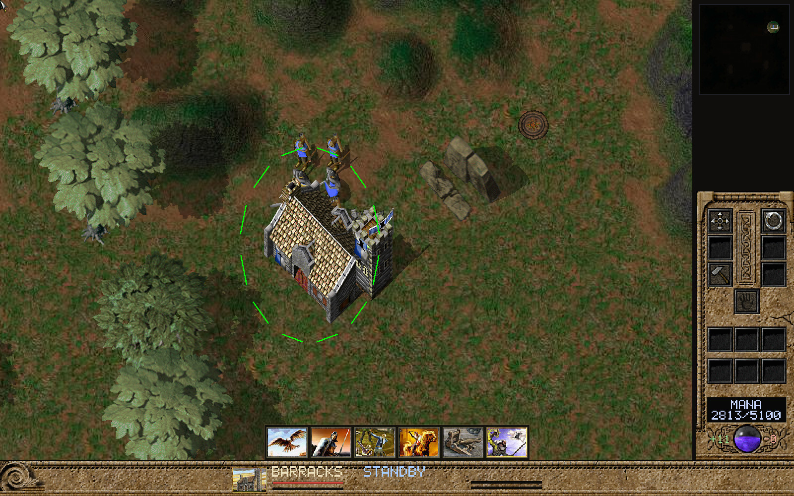</a><br><sub>Aramon base on Ulasem Arena</sub></td>
    <td width="50%"><a href="docs/img/naval.jpg">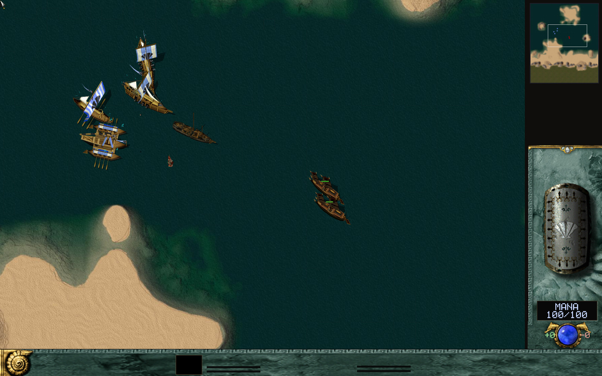</a><br><sub>Naval combat on Cairbray Coast Landing</sub></td>
  </tr>
  <tr>
    <td width="50%"><a href="docs/img/lobby.jpg">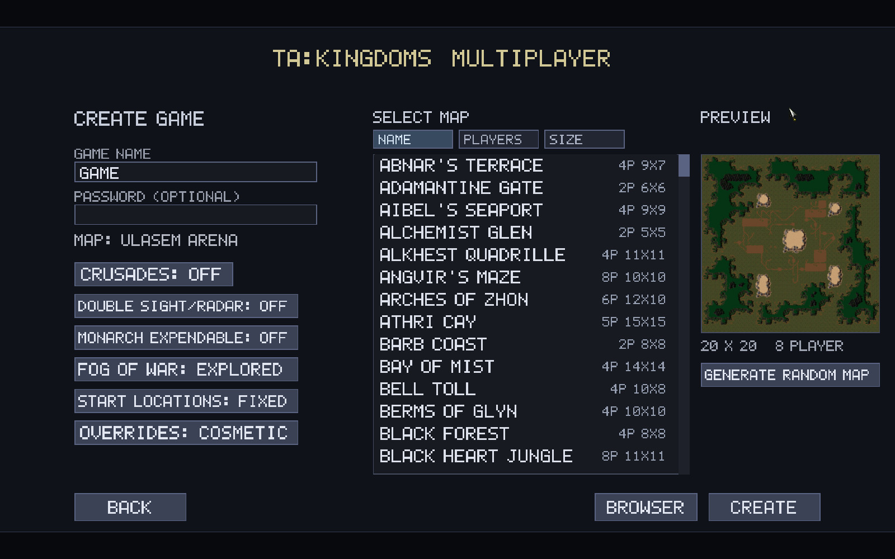</a><br><sub>Maps and match setup</sub></td>
    <td width="50%"><a href="docs/img/campaign.jpg">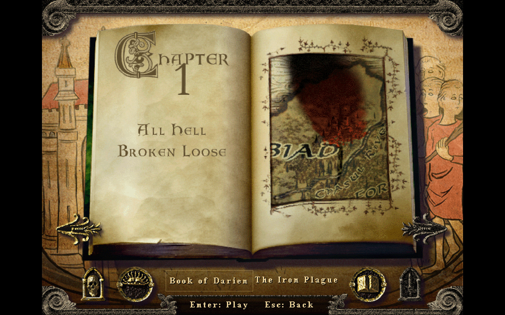</a><br><sub>Campaign selection</sub></td>
  </tr>
  <tr>
    <td colspan="2"><a href="docs/img/room.jpg">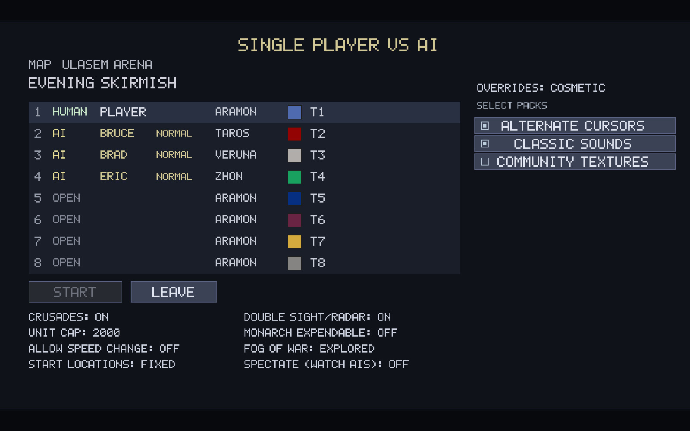</a><br><sub>Lobby settings and selectable override packs</sub></td>
  </tr>
  <tr>
    <td width="50%"><a href="docs/img/streaming.jpg">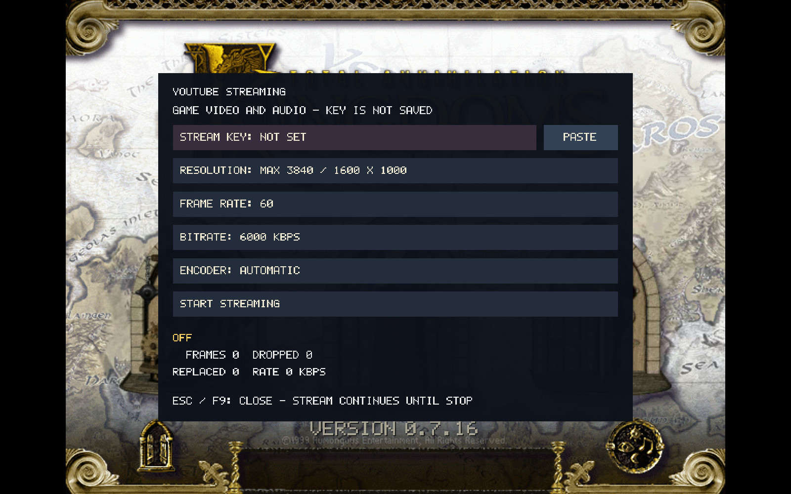</a><br><sub>Built-in YouTube streaming</sub></td>
    <td width="50%"><a href="docs/img/results.jpg">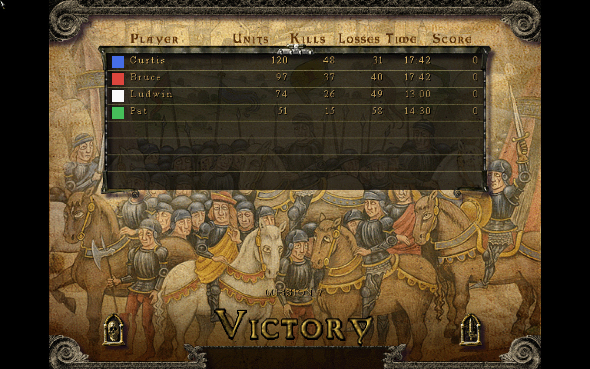</a><br><sub>Post-game statistics (sample data)</sub></td>
  </tr>
</table>

<sub>Captured from the 0.7.23 build. Army, base, and naval views: development demos. Results: sample statistics.</sub>

</div>

Command Aramon, Taros, Veruna, Zhon, or Creon in skirmishes, campaigns, and
multiplayer. The engine reads your original game's maps, models, scripts,
interface art, and sound directly from its installation.

**You need your own copy of Total Annihilation: Kingdoms.** No retail game
assets are included. An installation of *Kingdoms + The Iron Plague*, such as
the GOG edition, supplies the game data.

## New in 0.7.23

- **Optional Flowfield pathfinding:** choose Retail or experimental Flowfield when
  creating skirmish and multiplayer games. Shared terrain preparation and route
  workers have bounded work and memory. Campaigns keep Retail; its search
  implementation is unchanged. Maze traffic, group arrivals, factory exits,
  fight-move and patrol orders have expanded regression coverage.
- **Builder automation:** drag a lodestone placement box to build across eligible
  mana spots, exploring first when needed. Patrolling builders repair nearby
  damaged allies and then resume their route. Defensive AI intercepts spotted
  attackers near its base without sending offensive raids.
- **Map generation:** remembered map names with distinct recipe identifiers,
  preview updates on slider release, open lake and maze edges, faction layouts,
  connected Veruna harbors, and improved terrain transitions.
- **Presentation and controls:** independent F4 scorecard scale and team grouping,
  Shift+Z retail zoom, speeds up to 8×, real-time selected-unit emotes,
  offscreen sound fading, lodestone shadows, and corrected destructive scenery
  and wreck behavior. Single-player startup shows loading progress.
- **Graphics defaults:** filtering, smooth GUI/movies and AA are fixed off while
  their engine support remains. Trees sway by default and remain configurable;
  fullscreen, VSync, shadows, statistics, hardware cursor and smooth motion
  default on.
- **Linux packages:** native ARM64 packages alongside x64 for Ubuntu, Debian,
  Fedora and openSUSE Leap, plus Slackware64 15.0 and Arch x64 packages.

Version **0.7.23 uses protocol 221 and replay format 11**. Update clients and
servers together. Protocol-220/format-11 and protocol-219/format-10 recordings
remain supported with their original patrol behavior; older recordings require
an older engine. No new dynamic runtime dependencies or retail assets are
shipped. See the [release notes](docs/release-0.7.23-notes.md) and
[validation report](docs/release-0.7.23-validation.md).

### Previously in 0.7.22

- **Independent antialiasing:** Terrain AA (Off/2x/4x) and Model AA
  (Off/2x/4x/8x/16x), with native-resolution UI, preserved scenery ordering,
  remembered settings, and reported capability/memory fallbacks in that release.
  AA is now fixed off; renderer support is retained. See the
  [quality and performance comparison](docs/antialiasing.md).
- **Server hardening:** bounded map parsing and background validation, actual-size
  memory admission, command-processing budgets, automatic ACME retry recovery,
  and per-source HTTP challenge connection limits.
- **Linux service setup:** packaged systemd service and editable configuration
  templates, with [step-by-step hosting instructions](docs/public-server.md).
- **Build-site clearing:** builders continue through multiple reclaimable
  obstructions before starting construction.
- **Windows release signing:** shipped executables and the completed installer
  are signed and timestamp-verified before publication.

Protocol **213** and replay format **10** are unchanged. No new dynamic
runtime dependencies. See the [release notes](docs/release-0.7.22-notes.md)
and [validation report](docs/release-0.7.22-validation.md).

### Previously in 0.7.21

- **Selectable override packs:** put each pack in its own `overrides/<pack>/`
  folder, then select multiple packs in the lobby. Choices are remembered.
  Cosmetic mode filters gameplay files; Full host packs transfer automatically
  to the server and players. Files directly in `overrides/` never load.
- **Clearer lobby:** all game-create rules are shown as read-only information,
  including Crusades balance, monarch expendability, and generated-map settings.
  Choose Off/Cosmetic/Full when creating the game; select packs in the lobby.
- **Independent game workers:** each running match has its own simulation worker,
  so one busy match does not run its simulation on the shared network thread.
- **Public-server hardening:** verified TLS, authenticated accounts, command and
  upload limits, storage budgets, and an optional Linux service sandbox. Players
  can enter just a server name; TLS and port 7677 are selected automatically.
  Built-in Let’s Encrypt support opens port 80 only during HTTP validation.

Version **0.7.21 uses protocol 213**; update clients and servers together.
Replay format 10 records the shared override package. Protocol-212 format-9
recordings remain compatible with this simulation. No new dynamic dependencies
or retail assets are shipped. See the [release notes](docs/release-0.7.21-notes.md),
[validation report](docs/release-0.7.21-validation.md), and
[public-server deployment guide](docs/public-server.md).

### Previously in 0.7.20

Naval AI improvements cover all five factions in both balance modes, including
coastal production, usable shipyard launch routes, and smaller fleet deployment.
See the [naval AI audit](docs/naval-ai-2026-10-01.md).

### Previously in 0.7.19

- **Native Windows ARM64:** Release and Debug portable ZIPs, built and tested on
  Windows 11 ARM64. The x64 installer remains available. Windows ARM64 streaming
  supports CPU encoding; NVENC and Qualcomm hardware encoding are unavailable.
- **Native Intel macOS:** x64 app bundles, DMGs and Release/Debug ZIPs alongside
  Apple Silicon packages. Both macOS architectures require macOS 14 or later.
- **Platform reliability:** correct ARM64 media dependency targets and legacy
  map-path conversion handling with libc++.
- **Maintenance:** remove 22 unused engine helpers/fields and two obsolete tool
  blocks, preserving the live simulation, pathfinding and presentation systems.

Protocol remains **211**. Use matching engine builds and compatible game data
on all clients and servers. Media and campaign storage dependencies remain
statically linked. See the
[release notes](docs/release-0.7.19-notes.md) and
[validation report](docs/release-0.7.19-validation.md).

### Previously in 0.7.18

- **Darien Crusades service:** authenticated allegiance, territory browsing,
  opponent matching, tactical battles, verified results, history and retained
  replays. Servers explicitly enable it and supply territory map assignments;
  original territory-capture and campaign-victory rules remain incomplete.
- **Crusades balance corrections:** retail-derived damage, wind and water fields
  and build menus, backed by the documented balance audit.
- **Naval AI:** coastal shipyard planning and scripted launch checks let Veruna
  establish fleets without queuing ships at unusable launch positions.
- **Capture targeting:** Harpies and other converters reject targets they cannot
  capture and stop attacking targets that become ineligible.
- **Game flow and rendering:** victory opens results after three seconds,
  Spectate starts off for each skirmish setup, and supersampled rendering recovers
  more reliably after window resizing and renderer target resets.

Protocol is **211**; update clients and servers together. SQLite campaign storage
is statically linked, with no new shared library to ship. See the
[release notes](docs/release-0.7.18-notes.md) and
[validation report](docs/release-0.7.18-validation.md).

### Previously in 0.7.17

- Right-click cycles backward through game-create, lobby and streaming choices.
- Game-create settings and random-map recipes persist between sessions; passwords
  and Spectate are not saved.
- A local 24-hour clock appears beneath Units in the stats panel.

### Previously in 0.7.16

- **Larger generated maps:** sizes up to 64×64, with terrain-themed ruins around
  every new mana spot. Lodestone construction space and approach routes stay clear;
  saved version-1–3 recipes retain their original layouts.
- **Gentler Easy AI:** slower production decisions, smaller army targets, and
  attacks of at most eight units, beginning after four game minutes and spaced
  at least two minutes apart. Passive is now named **Defensive** and still
  builds and defends without sending attacks.
- **Conversion targeting:** Harpies, Mind Mages, and Ayla stop attacking targets
  that become allies, including when a conversion projectile arrives late.
- **Clear production exits:** completed units move far enough from their
  production spot to let the next unit start, including mobile infinite queues
  and factories without a rally point.
- **Matching results emblems:** the results screen uses the same faction icons
  and player colors as the F4 scoreboard, including after a player is defeated.

Version **0.7.16 uses protocol 203**. Update clients and servers together;
0.7.15 uses protocol 201 and cannot join the same match.
See the [release notes](docs/release-0.7.16-notes.md),
[validation report](docs/release-0.7.16-validation.md), and
[random-map guide](docs/random-map-generation.md).

### Previously in 0.7.15

Fully expired unit records are removed from the simulation, and render snapshots
use compact storage. Active corpses, scripts and in-flight attacks remain
available; unit IDs and delayed kill attribution stay intact.
See the [performance measurements](docs/unit-retirement-performance-2026-09-29.md).
The original nine-hour Windows slowdown still needs a long-session retest.

### Previously in 0.7.14

<table>
  <tr><td><a href="docs/img/cartographer.png">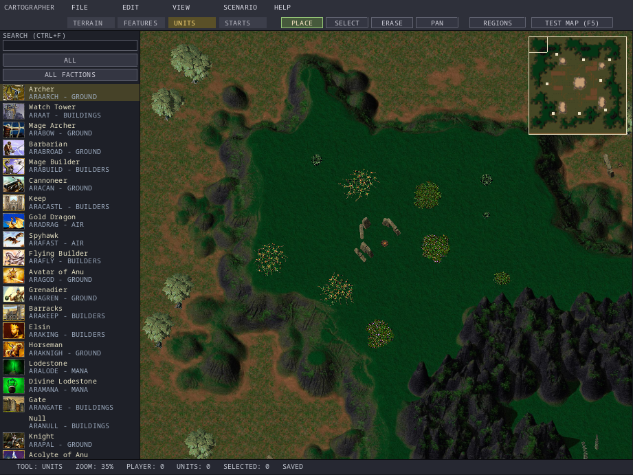</a><br><sub>Cartographer: unit browser and map canvas</sub></td>
  <td><a href="docs/img/cartographer-model.png">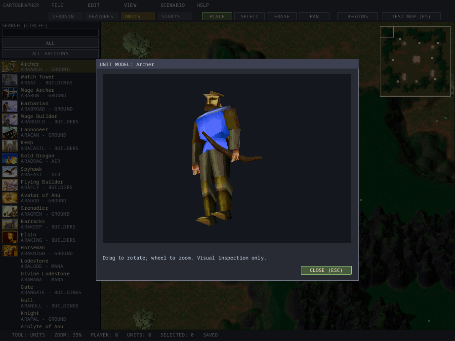</a><br><sub>F6 model inspector</sub></td></tr>
</table>

- **Authored scenarios:** Use Only construction restrictions, neutral placements,
  armor/weapon and veteran defaults, and independent player victory/defeat.
- **Retail trigger behavior:** corrected All Players rule ownership, once-per-second
  evaluation, resource limits/reset, absolute HP changes, creation/destruction,
  ownership transfer, movement destinations and wildcard selectors.
- **Placement and names:** footprint-origin positioning agrees between the editor
  and game; authored display names appear in-game with retail's 31-byte limit.
  The unused vertical field is preserved without inventing an altitude override.
- **Scenario feedback:** Display gameclock now works; validation explains name
  truncation and flag aliases. Optional Test Map trigger logs remain available.
- **Cartographer workflow:** searchable browsers, undo/redo and recovery,
  background saving, map checks, regions/rules, F6 model inspection and F5 Test Map.

Version **0.7.14 uses protocol 200**. Update clients and servers together.
See the [release notes](docs/release-0.7.14-notes.md),
[validation report](docs/release-0.7.14-validation.md), and
[Cartographer guide](docs/user-guide.md#map-editor). Full retail mission-runtime
parity is not claimed; remaining limits are documented in the
[scenario reference](docs/crt-triggers.md).

### Previously in 0.7.12

- **Diplomacy on D:** allied unit gifting, outgoing mana-sharing checkboxes for
  teammates, and checkboxes choosing who receives your chat.
- **Hard/Absurd expansion:** earlier expansion builders, reserved mana sites, and
  new deposits prioritized over nearby upgrades.
- **Memory/resource fixes:** font loading, model/editor teardown, stopped-stream
  buffers, and a terrain reload worker race.

See the [0.7.12 validation report](docs/release-0.7.12-validation.md).

### Previously in 0.7.11

- **Defensive AI:** continues growing its army and defenses near home
  as mana allows, without sending attacks.
- **Persistent Hard and Absurd AI:** keep expanding income and production and
  building troops beyond the former AI policy ceilings. Actual player and
  unit-type limits still apply. Absurd retains its double mana income.
- **Zhon production:** mobile producers prioritize an opening army and keep
  producing troops while other builders expand. Expansion orders remain counted
  while builders travel, and idle troops clear production sites.
- **Normal retains its force targets.** Movement and pathfinding rules are
  unchanged; these changes adjust the AI's production decisions.

See the [0.7.11 validation report](docs/release-0.7.11-validation.md) and
[AI behavior measurements](docs/ai-growth-2026-09-28.md).

### Previously in 0.7.10

- **Large-map performance:** terrain chunk caching, fog geometry reuse, fewer
  distant model and shadow submissions, and less pathfinding, script scheduling,
  and collision-grid overhead. These improve measured workloads; 4× simulation
  speed and 16,000-unit real-time play are not guaranteed.
- **Random maps and map sharing:** balanced generation with validated routes,
  automatic transfer of missing or differing maps, and generated maps saved on
  the host, clients, and server when play starts.
- **Team support:** allied unit gifting, shared vision, and surplus mana sent
  first to allies with the lowest storage fill percentage.
- **Setup and player identity:** choose unit limits and Allow Speed Change when
  creating a game; the lobby displays them. Leaving a skirmish lobby returns to
  creation. **Options → Player Name** sets the name for new local games.
- **Presentation and controls:** restored Unit Info fonts and button feedback,
  corrected stationary building rendering, mobile-builder production rally
  orders, and embedded Windows/macOS application icons.

See the [0.7.10 validation report](docs/release-0.7.10-validation.md),
[performance measurements](docs/performance-2026-09-28.md), and
[map sharing guide](docs/map-transfer.md).
Version 0.7.9 added Windows startup/audio fixes, direct GPU telemetry, and the
retail-style score table; see its [validation report](docs/release-0.7.9-validation.md).

Version 0.7.8 restored scripted corpses and death timing, improved building
lighting, and fixed streaming shutdown; its
[validation report](docs/release-0.7.8-validation.md) documents those changes.

Version 0.7.7 added automatic clearing of reclaimable construction obstacles,
in-place lodestone upgrades for all factions, more accurate contextual cursors,
Double Sight/Radar, explored-terrain memory, factory rally-order displays, and
multiplayer defeat handling that lets survivors keep playing. See its
[validation report](docs/release-0.7.7-validation.md) and
[construction, cursor, and ruin audit](docs/construction-cursors-2026-09-27.md).

Recent releases also added **YouTube streaming** with title/lobby music,
**Max 3840 / 60 FPS** defaults, hardware encoding, and VSync pacing; improved
rendering/shadow performance and campaign presentation; corrected naval
construction and combat; and restored the monarch-under-attack warning.
Group recall uses one number-key press to select and a second to track.

## Download

Get **version 0.7.23** from the [latest release](https://github.com/pocketgeek/tak-engine/releases/latest).
Choose the package for your system:

| System | Package |
| --- | --- |
| Windows x64 | `windows-x64-setup.exe` installer, or the portable ZIP |
| Windows 11 ARM64 | `windows-arm64.zip` portable package |
| macOS Apple Silicon, macOS 14+ | `macos-arm64.dmg`; drag **Total Annihilation - Kingdoms** to Applications |
| macOS Intel, macOS 14+ | `macos-x64.dmg`; drag **Total Annihilation - Kingdoms** to Applications |
| Ubuntu 22.04 / 24.04 / 26.04 | Matching `ubuntu…-amd64.deb` |
| Debian 12 / 13 | Matching `debian…-amd64.deb` |
| Fedora 44 | `fedora44-x86_64.rpm` |
| Arch Linux | `x86_64.pkg.tar.zst` |

Native **Linux ARM64** packages are also built by [Linux CI](https://github.com/pocketgeek/tak-engine/actions/workflows/linux.yml)
for Ubuntu 22.04/24.04/26.04, Debian 12/13 (`arm64.deb`), and Fedora 44
(`aarch64.rpm`), plus an ARM64 Debug tarball. Download these from a successful
workflow run and version 0.7.23 releases. Arch packages remain x64.
CI also builds **openSUSE Leap 16.0** RPMs for x64 and ARM64, and a native
**Slackware64 15.0** `.txz` package in version 0.7.23 releases;
install with `sudo zypper install ./tak-engine-…rpm` or
`sudo upgradepkg --install-new ./tak-engine-…txz`, respectively. Slackware does
not use systemd; run `takserver` directly with the documented command-line options.

Release filenames also include the project name and version. Install Linux
packages with `apt install ./…deb`, `dnf install ./…rpm`, or `pacman -U ./…pkg.tar.zst`
using administrator privileges. Linux packages include the client, dedicated
server, Cartographer map editor, and the offline `crusades_admin` tool.

DEB, RPM, and Arch packages also include `takserver.service` and an ACME
template. They do not start the server automatically. Follow [Linux server setup](#linux-server-setup)
below to configure the packaged service and obtain its certificate.

Game libraries are bundled; your system still provides windowing, audio, and
graphics support. On macOS, right-click → **Open** on the first launch if needed.
For the ZIP, launch **Total Annihilation - Kingdoms.app**, rather than its internal executable.

Packages label the client **Total Annihilation: Kingdoms**
(**Total Annihilation - Kingdoms** for Windows shortcuts and the macOS app folder),
omit server launchers, and start the Windows client without a console window.
Windows executables/installers and the macOS app bundle include the crown icon.
The macOS bundle keeps its required `.app` suffix on disk. Finder’s filename-extension
preferences control whether that suffix is displayed.
The `-debug` downloads are for diagnostics and development.

## Linux server setup

These steps use the installed Linux package and built-in Let's Encrypt support.
You do **not** need to download or copy a service unit from the source repository.

1. **Choose a hostname and configure networking.** Point a hostname you control
   (for example, `tak.example.org`) at the server. Allow inbound TCP **80** for
   certificate validation and **7677** for the game, plus outbound HTTPS **443**.
   If you publish an IPv6 address, it must reach this server too. Another service
   must not occupy port 80 when takserver validates its certificate.

2. **Copy your retail game data.** Replace `/path/to/retail-install` below with
   the actual directory containing your game's archives and maps:

   ```sh
   sudo mkdir -p /srv/tak-data
   sudo cp -a /path/to/retail-install/. /srv/tak-data/
   sudo chown -R root:root /srv/tak-data
   sudo chmod -R a+rX /srv/tak-data
   ```

   The service cannot read `/home` because of its sandbox. Do not use a symlink
   back into your home directory. Clients need matching base game data.

3. **Install the ACME override template.** For a first-time setup:

   ```sh
   sudo mkdir -p /etc/systemd/system/takserver.service.d
   sudo cp -i /usr/share/doc/tak-engine/systemd/takserver-acme.conf \
     /etc/systemd/system/takserver.service.d/acme.conf
   ```

   If you already have `acme.conf`, keep it and edit it instead of overwriting
   your configuration. The packaged unit is already installed at
   `/usr/lib/systemd/system/takserver.service`.

4. **Set your hostname before starting.** Open the copied override:

   ```sh
   sudoedit /etc/systemd/system/takserver.service.d/acme.conf
   ```

   Replace **`YOUR.SERVER.NAME`** after `--acme-domain` with your actual hostname
   (for example, `tak.example.org`), without `https://` or a port. The data path defaults to `/srv/tak-data`; use the settings template below to
   change it. Keep the empty `LoadCredential=` and
   `ExecStart=` lines; they replace the default manual-certificate configuration.
   Using `--acme-agree-tos` accepts the CA subscriber agreement.

5. **Enable and start the service.**

   ```sh
   sudo systemctl daemon-reload
   sudo systemd-analyze verify takserver.service
   sudo systemctl enable --now takserver
   ```

   If it was already running, also run `sudo systemctl restart takserver` to
   apply your changes. Systemd creates the private state directory automatically.

6. **Check startup, then connect.**

   ```sh
   sudo systemctl status takserver --no-pager
   sudo journalctl -u takserver -f
   ```

   For first-time ACME setup, wait for `ACME: certificate installed` before connecting.
   A listening service can still be waiting for issuance or a persisted retry deadline.
   Players then enter just your hostname in the multiplayer connection screen.
   Press Ctrl+C to leave the log viewer; this does not stop the server.

**Optional: change server defaults.** Copy and edit the settings template:

```sh
sudo mkdir -p /etc/systemd/system/takserver.service.d
sudo cp -i /usr/share/doc/tak-engine/systemd/takserver-settings.conf \
  /etc/systemd/system/takserver.service.d/settings.conf
sudoedit /etc/systemd/system/takserver.service.d/settings.conf
sudo systemctl daemon-reload
sudo systemctl restart takserver
```

The template lists the default paths, port, game/account limits, storage budgets
and systemd resource limits. Change individual values such as
`Environment="TAK_SERVER_MAX_RUNNING_GAMES=8"` without rewriting the startup
command. It works with both certificate modes. Restart between matches, since
it disconnects active games. For examples and existing-installation migration,
see [changing server defaults](docs/public-server.md#changing-server-defaults).

The server renews its certificate automatically and opens port 80 only during
validation. Local configuration stays in `/etc/systemd/system/takserver.service.d/`;
accounts, maps, replays and certificate state live under `/var/lib/takserver`.
Server package validation runs off the network loop with bounded admission and work
limits; ACME retries initial issuance automatically while refusing game connections
until its certificate is ready. See the [resource controls](docs/public-server.md#resource-controls)
for custom-content limits and flood protection.

See [public-server deployment](docs/public-server.md#linux-service-setup) for
manual certificates, troubleshooting, service limits and upgrades. Setup notes
are also installed at `/usr/share/doc/tak-engine/systemd/README.md`.

## Getting started

1. Install or unpack TAK Engine.
2. Launch **Total Annihilation: Kingdoms** and choose your original game's installation folder
   when prompted. Select the folder containing the retail `.hpi` archives;
   no extraction is needed. The engine remembers this location.
3. Choose the single-player door for a skirmish, multiplayer to join a server,
   or campaign to browse the missions.
4. Pick your map, faction, opponents, and balance settings, then start playing.

You can also supply the data folder explicitly:

```sh
takclient --data /path/to/tak_install
```

Release builds otherwise use the menus; `--version` prints the installed
version. Custom maps belong in the installation's `Maps/` folder, and custom
content belongs in named pack subfolders of `overrides/` (files directly in that
folder are never loaded). Unknown archives dropped into the installation
root are not loaded. See the [game-data guide](docs/user-guide.md#game-data)
for layout, archive precedence, and troubleshooting a rejected folder.

## What you can play

- **Skirmish:** up to eight slots, five factions, teams, generated maps,
  retail or Crusades balance, and five AI difficulty levels.
- **Multiplayer:** hosted games, shared allied vision, spectators, reconnects,
  and a server referee running the same deterministic simulation as the clients.
- **Darien Crusades:** territory browsing, two-player tactical battles, verified
  history and retained replays on an explicitly configured campaign server.
  Historical territory capture and campaign-victory rules remain incomplete.
- **Campaigns and scenarios:** mission scripts and scenario triggers, using
  the original game data. Individual missions remain subject to ongoing fixes.
- **Replays:** open recorded matches through **Settings → Load Replay**.
- **Map editing:** Cartographer creates and edits terrain, objects, start
  positions, named regions, and scenario rules, and exports `.kmp` map bundles.
  The **Regions** tool draws, moves and resizes trigger areas on the map;
  **Enter** opens the selected region's name and coordinates. Editing supports
  undo/redo and periodic recovery copies. Save/export prepares minimaps, packs and
  writes a snapshot in the background, with progress and Escape cancellation before
  publication; the short replacement step finishes or rolls back. Recovery tries the previous snapshot
  if the newest copy is damaged. Shrinking a map asks before cropping terrain
  and features; move outlying units, starts and regions inside first.
  Units and features support box selection,
  group movement, copy/paste and deletion; feature moves protect occupied cells.
  **View** can hide features, units, starts and regions; layer choices are remembered.
  Terrain thumbnails, unit portraits and feature sprites load in the background;
  the minimap refreshes after terrain edits. Check Map reports starts, mana,
  terrain connectivity, missing resources and initial naval output clearance.
  Buildability overlays include preplaced units using the engine's placement rules.
  **F6** opens a rotatable 3D preview of a selected unit or browser entry.
  **Test Map (F5)** opens a temporary snapshot in the normal private game lobby,
  leaving the editor and unsaved document open. Seat the players used by your
  scenario, then start. Verified authored scenarios can start with one player in
  0.7.14; ordinary skirmishes still require two participants.
  Authored placements and rules run on both client and server.
  **Scenario → Log Test Map triggers** optionally records firing groups and
  attempted actions in a bounded local log; the launch message shows its path.
  In 0.7.14, **Use Only** limits player/AI construction, neutral
  placements keep a separate owner, and custom armor/weapon percentages affect
  combat. Victory/Defeat rules determine authored scenario outcomes; no such rule
  means the scenario can remain a sandbox. See [scenario details and limits](docs/crt-triggers.md).
  Close the test game to return to editing. Verified snapshots remain in the map
  cache, like other downloaded maps; the temporary source is removed after exit.
  A first-launch guide introduces editing and saving. Hover over toolbar controls,
  filters or the minimap for action help and shortcuts.
  The embedded editor font supports mixed case, accented Latin, Greek and Cyrillic.
  **T** opens scenario scripting; its full-text area wraps long operands, supports
  **Page Up/Page Down** scrolling, and offers **Copy Text** for the selected rule.
  Select a rule group and press **Enter** or **Name** to label it. Names survive
  undo, copying and reopening; they are stored as editor metadata beside the
  unchanged retail scenario data.
  **Templates** in the scripting window searches common objectives and inserts
  editable rules for briefings, timed victory, reaching an area, elimination,
  losing all forces, or reinforcements. Check the inserted unit, region and time.
  Flag fields accept new names or suggest existing flags from that player’s rules;
  use the arrow button or **Alt+Down** to open the suggestions.
  **Scenario → Check Map** reports
  terrain, start, mana and scenario issues in a clickable results list, including
  disconnected movement regions for distinct mobile unit profiles and footprints,
  plus missing or corrupt terrain images.
  **Scenario → Regenerate from Recipe** restores a generated map's settings;
  preview changes before accepting them. Reproduction needs the same game assets.

Each ordinary skirmish starts with your Monarch. Build your economy and army;
Zhon's mobile conjurers replace the conventional keep-based production chain.
Unless **Monarch Expendable** is enabled, losing your Monarch loses the game.
The lobby supports a maximum of **2,000 live units per player**.
**Double Sight/Radar** doubles every unit's sight and radar distance in skirmish
and multiplayer. Choose it in game setup; the lobby only displays its status.
It does not change weapon range or campaign missions.
Terrain you have explored remains visible under fog after your units leave;
enemy units outside current sight remain untargetable.

| AI | What to expect |
| --- | --- |
| Defensive | Keeps building at home; sends its army to intercept spotted threats near its base and buildings, then recalls it; sends no offensive raids |
| Easy | Builds slowly; first attack after four minutes, then waves of at most eight units at least two minutes apart |
| Normal | Sends probing raids while saving a larger attacking force |
| Hard | Keeps expanding income and production, spending on raids and larger attack waves |
| Absurd | Hard behavior with double mana income, including reclaim |

Choose **Generate Random Map** under the map preview to configure a Mainland,
Lakes, or Islands map, up to **64×64**. Every new mana site has surrounding ruins.
The available sizes depend on the layout and player count.
Drag a density slider to choose its value; the preview regenerates once you
release it. New Lakes maps can reach the map edge, without a forced land border.
Enter an optional **Map Name** (up to 24 letters, digits, spaces, hyphens or
underscores). It becomes the saved map's browser name and part of its filename;
a short recipe hash also appears in the saved map list, so maps with the same
title remain individually selectable. Blank names use the automatic description.
The name and generator choices are remembered. Host, clients and server save
the same named map when the game starts. Older recipes retain their terrain.
Each biome also offers a themed layout: **Aramon Riverlands**, **Taros Maze**,
**Veruna Ports**, **Zhon Clearings**, or **Creon Highlands**. Cycle Layout to the
fourth choice; changing Type while themed switches to that biome's layout.
Ports guarantees connected deep-water harbor sites; the land themes retain
connected army routes. Themed layouts start at 16×16 (24×24 for 5–8 players).
New maze corridors open onto all four map edges instead of enclosing the map in walls.
Version 0.7.23 uses protocol **221**: update clients and servers together.
The preview reflects the selected seed and settings; see
[random map generation](docs/random-map-generation.md) for the placement and
connectivity rules.

The AI considers income and available terrain when building its force.
[The user guide](docs/user-guide.md#playing) explains standing orders,
production queues, match options, and AI behavior in more detail.

## Player scores

The results screen uses retail scoring: destroying a completed unit adds that
unit's authored **experience points** to the attacking player's score. Values
come from the active balance data, so Retail and Crusades can award different
points for the same unit. For example, a Taros Zombie is worth 3 points in Retail
and 5 in Crusades.

Building units, gathering mana, and losing your own units do not change your
score. Destroying your own units or unfinished construction awards no points;
retail does award points for destroying another player's units even if allied.
Some campaign scripts explicitly control the score instead. See the
[retail scoring evidence](docs/campaign-presentation-2026-09-26.md#result-score).

### Darien Crusades strategic campaigns

<a href="docs/img/crusades.jpg">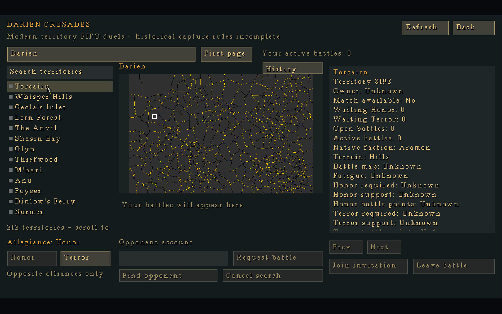</a>

<sub>Local imported Darien definition: original territory artwork; ownership and battle-map assignments remain unknown.</sub>

The **Darien Crusades** entry is temporarily hidden from the multiplayer game
browser. The underlying campaign service and screen remain implemented for
future restoration. The screen supports browsing territories, server ownership,
battle activity and details. Join Honor or Terror and use **Find opponent** on an
eligible territory, or enter an enrolled opponent's account to request a battle
directly. The server pairs opposite-alliance searches in arrival order and shows
waiting, offered and active battle counts. **Cancel search** removes your waiting
entry; searches also expire after ten minutes. Eligible invitations
open the existing battle lobby; its factions and rules are chosen by the server.
Within the running app, **Sign in again** restores the campaign and territory
when you reconnect to the same server with the same account.

Choose **History** for an enrolled campaign territory to see verified
results, dates and player statistics. **Watch Replay** downloads a retained
recording, verifies it, and opens the existing replay viewer. Press **Esc** to
return to the same territory. Missing recordings leave the results intact;
playback requires matching gameplay data and the recorded map.

This is a modern two-player campaign service. Historical territory capture and
campaign-victory formulas remain incomplete, so a tactical win does not invent
an ownership change. The strategic map reads original artwork from your own
installation when all territory IDs and names match the server. Otherwise it
shows a labeled schematic with a searchable territory list.

Servers must explicitly enable the campaign service and supply a campaign
definition. The `crusades_import` tool can create an unowned, unmapped definition
from your installed `Darien.def`; battle-map assignments require server authoring.
See the [strategic interface and setup guide](docs/research/darien-crusades/campaign-ui.md)
and [server battle setup](docs/research/darien-crusades/campaign-battles.md).
Packages include `crusades_admin` for offline inspection, health checks, backup,
start/reset and safe battle cancellation. See the
[server operations guide](docs/research/darien-crusades/campaign-operations.md)
for migration and tested restoration. Interrupted campaign battles are cancelled
with an audit on server restart; their history remains, without invented results.
The [matchmaking guide](docs/research/darien-crusades/campaign-matchmaking.md)
describes the modern policy and its verification. The [history and replay guide](docs/research/darien-crusades/campaign-history.md) explains archive access and retention.
The [historical validation audit](docs/darien-crusades-reconstruction.md) separates
confirmed retail evidence, reconstructed client behavior, modern service choices
and the original server rules still missing.

## Controls

These are the engine's default bindings. Command, selection, view, and emote
bindings can be changed in **Settings → Controls** (click a row and press a
new key; right-click clears it). Number-key squads, **Esc**, chat, pause, and
speed controls are fixed. Orders requiring a target are armed by the key and
issued with a left-click; **Shift** queues the order.

### Orders and unit actions

| Key | Action |
| --- | --- |
| **M** | Move |
| **A** | Attack |
| **F** | Fight-move |
| **P** | Patrol |
| **G** | Guard |
| **H** | Heal / repair a friendly unit |
| **L** / **U** | Load a passenger / unload at a destination |
| **S** / **C** | Stop / clear orders; both clear the selected units' queues |
| **W** | Cycle the active weapon of a selected unit with multiple weapons |
| **K** | Toggle cloak for selected units that can cloak |
| **O** | Open / close selected gates |
| **D** | Open diplomacy: give eligible selected units, toggle outgoing mana sharing with teammates, and choose chat recipients |
| **Ctrl+Shift+D** | Toggle self-destruct for selected units; press again to cancel |

### Selection

These shortcuts select your own units. Category selections replace the current
selection. **N** requires a current selection to cycle from.

| Key | Select |
| --- | --- |
| **Ctrl+A** | All your units |
| **Ctrl+Z** | All units of every type in the current selection |
| **Ctrl+U** | All your units on screen |
| **Ctrl+X** | On-screen units matching the first selected unit's type |
| **Ctrl+M** | Your monarch, and follow it with the camera |
| **Ctrl+B** | Builders, including builder structures |
| **Ctrl+F** | Factories / builder structures |
| **Ctrl+E** | Mobile melee units |
| **Ctrl+G** | Mobile magic users with a personal mana pool |
| **Ctrl+N** | Boats / water-domain units |
| **Ctrl+R** | Units with ballistic weapons |
| **Ctrl+T** | Armed mobile troops, excluding boats and monarchs |
| **Ctrl+W** | Armed units, excluding monarchs |
| **Ctrl+Y** | Flying units |
| **N** | Next unit |

### Groups and formations

| Key | Action |
| --- | --- |
| **Ctrl+1–0** | Assign the selection to a group |
| **Alt+1–0** | Assign the selection to a formation |
| **Ctrl+Shift+1–0** / **Alt+Shift+1–0** | Append to a group / formation |
| **1–0** | Select the group or formation; press again to track it; **0** is squad 10 |
| **Ctrl+Esc** | Remove selected units from their squads |

A unit belongs to one squad at a time. Each number holds either a group or a
formation; formations move at their slowest member's speed. Recall skips
builders, but units they produce inherit their squad.

### Camera, information, and game controls

| Key | Action |
| --- | --- |
| **Arrow keys** | Pan the camera |
| **T** | Toggle camera tracking of the selection |
| **Tab** | Toggle the full-screen map; press again to return |
| **F1** | Toggle unit information; **Enter** or **Esc** also closes the dialog |
| **F4** | Toggle player names, kills, losses, and score; team numbers appear and rows group by team when any team has multiple players |
| **F9** | YouTube streaming setup / status |
| **O**, with no units selected | Toggle campaign objectives when available |
| **Pause** | Pause / resume the game or replay |
| **Shift+Z** | Reset to retail’s native 1:1 zoom, keeping the same view center |
| **+** / **−** (also **=** and keypad **+/−**) | Change game / replay speed |
| **Enter** (also keypad Enter) | Open chat; press again to send; **Esc** cancels |
| **Esc** | Close unit information, cancel placement / an armed order, clear selection, then open the game menu as applicable |
| **Shift+D** | Selected mobile units disco for 10 real seconds; with no selection, living monarch |
| **Shift+H** | Selected mobile units headbang for 10 real seconds; with no selection, living monarch |

Live game speed ranges from 0.5× to 8× in 0.5× steps. Only the host can change it, and the
game creation screen’s **Allow speed change** option must be enabled (the lobby
only displays it). Chat is available in live networked games (single-player also uses a local server), not replay playback.

### Mouse and construction

| Input | Action |
| --- | --- |
| **Left-click / left-drag** | Select a unit / box-select |
| **Shift** + selection | Add to the selection |
| **Ctrl** + selection | Remove from the selection |
| **Right-click** | Contextual move, attack, or other applicable order; **Shift** queues |
| **Right-click a cycling setting** | Previous choice (left-click selects the next); works in game setup, lobby, options toggles, and streaming settings |
| **Middle-drag / screen edges** | Pan the camera |
| **Mouse wheel** | Zoom toward the cursor |
| **Minimap left-click / drag** | Move the camera; an armed order instead targets that location |
| **Minimap right-click** | Move the selection there; **Shift** queues |
| **Build icon left-click / right-click** | Add / remove one queued unit at a training building |
| **Shift** / **Ctrl+Shift** + build-icon click | Add or remove five / ten queued units |
| **Ctrl+left-click** a build icon | Start infinite production; toggle it at stationary producers |
| **Left-click** while placing | Place the construction site |
| **Left-drag** while placing a lodestone | Build on eligible mana spots in the box; **Shift** appends the area job |
| **Shift+left-click / drag** while placing | Queue a site / a line of sites |
| **Right-click / Esc** while placing | Cancel placement |
| **Right-drag** with a reclaim-capable mobile builder | Reclaim an area; **Shift** appends the sweep |

Mobile builders use build icons to arm placement instead of ordinary factory
queues. A reclaim-capable builder automatically clears trees, rocks, and other
reclaimable obstacles from a valid site before construction starts. Terrain,
other units, and unreclaimable obstacles can still prevent placement.

For basic or Divine lodestones, choose the build icon and left-drag a box over
the map. The builder explores unseen deposits, then builds on each eligible
spot in map order, clearing reclaimable obstacles when it can. Occupied or
unreachable spots are skipped; Divine lodestones can upgrade your faction's
completed basic lodestones. **Shift** queues the area behind existing orders;
**Stop** cancels it.

Patrolling mobile builders automatically repair nearby damaged allied units and
buildings, spending mana at their ordinary repair rate. They resume the same
patrol afterward and do not follow an ally that leaves the repair area. They
leave unfinished construction to explicit build or assist orders.

To upgrade a lodestone, choose your faction's advanced version and place it on
your completed basic lodestone's mana spot. Its larger footprint must fit. The
old building dissolves during the first half of construction; the new one
materializes during the second half. The upgrade uses the normal advanced cost
and build time, needs no extra unit-cap slot, and produces no mana until complete.
Cancellation or destruction does not restore the consumed basic lodestone.

While a mobile builder runs an infinite queue, **Move** and **Patrol** set rally
orders for its produced units; **Shift** appends rally steps and displays the route.
**Stop** cancels production and restores normal control of the builder. See the [user guide](docs/user-guide.md#controls)
for construction and reclaim details.

## Multiplayer and replays

Choose a server through the multiplayer menu, sign in, then create or join a
game. An unused account name is registered on first sign-in. Players connect
to the server; only the server needs an incoming network port available.
Single-player starts its own private server automatically. A loading screen shows
startup stages and map-list progress before opening game setup.

Multiplayer automatically verifies and transfers missing or differing maps before play.
Downloaded maps remain available in the map picker; generated maps are saved on every
participant and the server when the match starts. See [map sharing and storage](docs/map-transfer.md).

**Multiplayer bandwidth:** AIs run on the server. The network sends orders and
lockstep ticks; each client simulates movement and combat locally. Traffic depends
mainly on command volume, rather than continuously sending every unit's position.
At 1× speed, each human player or spectator receives about **0.5 KB/s** of tick
framing, plus **35 bytes per ordinary unit command** from all participants and AIs
combined (43 bytes for an area-reclaim command). For example, 100 ordinary commands
per second is about **4 KB/s / 32 kbps**, and an order to 2,000 units creates roughly
a **70 KB burst**. These are protocol calculations, not measured typical usage;
TCP/IP overhead, acknowledgments, checksums, chat, and retransmissions add traffic.

At 4× speed, the same simulated activity generally produces about four times the
traffic per real second. Server upload scales with the number of connected humans
and spectators, because each receives a copy; AIs do not require separate network
connections. Missing-map downloads and late-spectator/reconnect catch-up are larger
transfers. During ordinary gameplay, low latency and low packet loss matter more
than raw bandwidth. These figures exclude YouTube streaming, which uses the
separate bitrate selected in streaming settings.

Allies share vision automatically. Excess mana is distributed to allied players
with the lowest storage fill percentage first, among teammates you allow in
**D — Diplomacy**. Mana sharing starts enabled for teammates; chat starts enabled
for everyone and controls who receives your messages. The dialog lists all players,
with gift buttons and mana checkboxes shown only for allies. Gift buttons are disabled
without eligible selected units. Giving units keeps the dialog open and updates
the buttons. Ineligible units remain yours; transfers
respect the recipient's unit limits, remove transferred units from your control
groups, and change them to the recipient's colors. Campaigns do not offer gifting.
See [unit gifting](docs/unit-gifting.md) for eligibility details and the
[diplomacy screen](docs/img/diplomacy.jpg).

Choose the per-player unit limit on the game-creation screen: the button cycles
through 250, 500, 1,000, and 2,000. The lobby displays this value without allowing
it to change. **Pathfinding** also belongs to game creation: choose **Retail**
(the default) or **Flowfield** for skirmish and multiplayer. Left- or right-click
cycles the choice; the lobby shows the host's choice as read-only information.
Campaigns retain Retail pathfinding regardless of the saved create preference.
Flowfield is experimental. It shares prepared terrain tiles, prepares large tile
jobs in parallel, and delivers detailed routes as their required connectivity
becomes ready. Bounded caches avoid allocating the worst-case 512 MiB limit up
front; measured Flowfield storage was about 48–92 MiB in the latest flat and
maze tests. Giant maps with many players and movement classes can still incur
long waits. Better route throughput does not guarantee lower simulation cost.
See [implementation, limits and measurements](docs/pathfinding-port.md).

Use the **same engine build and compatible game data** on every participant.
Version **0.7.23 uses protocol 221**, including authoritative pathfinding
selection, shared override-pack transfer, and Darien Crusades campaign messages.
Update clients and servers together; earlier clients cannot join these matches.
Protocol-220 format-11 and protocol-219 format-10 recordings remain playable
with their original pathfinder and patrol behavior;
older incompatible recordings need their original engine.
The connection checks gameplay definitions, scripts, and models. Selected map
contents are verified separately and transferred automatically when needed.

Clients record matches in their per-user application data directory beside
`settings.ini`. Replays contain commands and match setup, not game assets.
[Hosting and accounts](docs/user-guide.md#multiplayer) and
[replay playback](docs/user-guide.md#replays) are covered in the user guide.

## Display and performance

Set **Options → Player Name** and click **Save** to choose your name for new
local and unauthenticated multiplayer games. Account-based multiplayer uses
your login name.

Use **Options** to adjust audio, shadows, health bars, UI scale, cursor size,
and camera behavior. **F4 Scorecard Scale** independently adjusts the player
scorecard from 75–200% and is remembered between sessions. Fullscreen, VSync, Shadows, Stats Panel, Hardware Cursor,
and Smooth Motion default to **on**; saved choices still apply.
Bilinear Filtering, Smooth GUI Art, Smooth Movies, Terrain AA and Model AA are fixed **off** and have no settings controls.
Existing values for these disabled options (including legacy `antiAlias`) in
`settings.ini` are ignored and are omitted when settings are saved. The engine's
rendering support is retained; see [antialiasing](docs/antialiasing.md) for the
implementation and historical measurements. **Trees Sway in Wind** is selectable,
defaults to **on**, and remembers your choice.

World sounds stay at full volume inside the camera view and fade with distance
outside it, becoming silent one shorter viewport dimension beyond the nearest
edge. Moving or zooming the camera updates playing sounds too. This is an
intentional improvement over retail's fixed offscreen volume; UI sounds, global
alerts and background music are unaffected.

The shadow option controls unit, scenery, and projectile shadows. Shadows follow
animated poses, including swaying trees; shading baked into terrain artwork
remains visible. Accelerated renderers use cached shadow silhouettes and tiles,
with fallbacks where needed. Animated boat shadows are an intentional enhancement
over retail Glide, controlled by the same Shadows option. All basic and divine
lodestones also cast shadows from their visible model pieces, intentionally
overriding retail scripts that suppress their shadows.

At distant zoom with Model AA off, tiny stationary units can use cached body images; moving,
selected, and special-effect units retain their full geometry. Wide-map rendering
also reuses fog geometry and combines fog cells over flat terrain. See the
[distant rendering measurements](docs/distant-rendering-performance.md) for
limits and local comparisons.

Unit scripts control corpse selection and the handoff from death animation to
wreck. Buildings also use the authored palette shading and per-piece shadow
flags observed in retail Glide.

Game-create choices are remembered between sessions: balance, sight/radar, unit
cap, pathfinding, monarch rule, speed changes, fog, start locations, overrides,
game name, map selection/sorting, and random-map settings (including the seed).
Spectate starts off for each skirmish setup. Game passwords are not saved.

The in-game stats panel shows a local **Clock** (24-hour time) beneath **Units**,
plus **Real Time**, **Game Time**, **Client CPU**
(the game process’s share of total CPU capacity), and whole-system GPU usage. When the client
launches a local server for a skirmish or campaign, **Server CPU** shows that
server process’s share of total CPU capacity (0–100%). It is omitted for remote
servers; unavailable samples display N/A.
NVIDIA statistics query the GPU through the driver-provided NVML library
on Windows and Linux, without launching `nvidia-smi` or bundling extra libraries.
AMD Linux uses amdgpu sysfs, Intel Linux uses i915 perf counters (subject to kernel
permissions), and macOS uses IORegistry. Windows AMD/Intel use Windows GPU Engine
counters across all processes, reporting the busiest engine at 0–100%; adapter
identity and dedicated memory come from DXGI and Windows memory counters.
These use built-in Windows libraries, with no extra downloads. Unsupported
counters (including Linux Xe utilization) display N/A. On multi-GPU systems,
NVIDIA uses its first adapter; the Windows fallback reports the busiest adapter.

**Settings → Benchmark** provides a repeatable eight-AI load test and reports
frame rate, simulation speed, memory, and other available performance metrics.
Client and server CPU results each use 0–100% of total machine CPU capacity.
GPU results use the same 0–100% whole-device measurement as the stats panel;
unavailable measurements display N/A.
Testing targets up to **16,000 total units**, not a guarantee of real-time play
at that population. Map, unit mix, orders, hardware, and graphics settings all
matter. See the [large-map collision-grid results](docs/large-map-collision-performance.md),
[moving-army, shadow and simulation results](docs/performance-2026-09-28.md),
[geometry and shadow reuse results](docs/render-reuse-2026-09-26.md),
[rendering and animation improvements](docs/render-submission-2026-09-26.md),
[engine profiling results](docs/performance-2026-09-26.md), and
[earlier performance notes](docs/performance-2026-09-20.md).

## Project status

TAK Engine is playable and under active development. The aim is an accurate
representation of retail behavior; this is not a claim that every mission,
animation, or interaction is identical or fully verified.

Selected movement, combat, transport, scripting, and animation routines are
checked against the original executable through headless emulation. Ground
pathfinding parity is a continuing constraint on engine changes. The skirmish
AI is this project's implementation, rather than a reproduction of retail AI.

For the evidence and remaining scope, see the [retail engine notes](docs/retail-engine.md),
[pathfinding work](docs/pathfinding-port.md),
[guessed-behavior corrections](docs/guessed-fallback-audit-2026-09-26.md),
[campaign implementation and comparisons](docs/campaign-design.md),
[transport and animation audit](docs/transport-animation-audit-2026-09-21.md), and
[naval building placement correction](docs/naval-building-placement.md).

## YouTube streaming

Open **Settings → YouTube Streaming** at the title screen, **Esc → YouTube
Streaming** in a game, or press **F9**. Copy your YouTube Studio stream key,
click **Paste**, and then **Start Streaming**. The key is masked, stays in memory,
and is excluded from captures and diagnostics.

The defaults are **Max 3840** and **60 FPS**. Max 3840 scales down to at most
3840 pixels wide while preserving your window's aspect ratio: a 7680×2160
window sends 3840×1080. Smaller windows are not enlarged. Output dimensions
are fixed when you start; stop and restart to change them. Other choices are
720p, 1080p, 1440p, 4K, and Full Resolution, with 30 or 60 FPS.

Bitrate is adjustable from **3,000 to 80,000 Kbps**; the initial value is
**6,000 Kbps**. Increase it for higher-resolution video as your upload permits.
The highest selectable value is not a YouTube recommendation. Full Resolution
can exceed YouTube's accepted dimensions even when your GPU can encode it;
use Max 3840 or 4K if YouTube reports an unsupported resolution.

Automatic encoding tries NVIDIA, AMD, Intel, or Apple hardware, with CPU fallback
at smaller sizes and hardware HEVC for dimensions beyond common H.264 limits.
The panel shows the encoder actually used. **Dropped** counts missed output
frames; **Replaced** counts superseded capture submissions. Rendering slowdowns
skip late frames without forcing reconnects. With VSync enabled, a refresh-rate
pacing fallback keeps streaming from uncapping presentation.

Closing the panel or returning to the title screen keeps the stream running.
Stop it with **Stop Streaming** or exit the application. Game audio is included;
title and lobby music is included too. Loading/modal screens retain the last
captured frame. Microphone capture is not included.

FFmpeg, its codecs, and additional non-system dependencies are linked statically;
no separate FFmpeg installation is required. GPU encoding uses the installed
system driver. See [streaming setup and platform details](docs/streaming.md).

## Build and contribute

Source builds use C++20, CMake, and the bundled static dependency builds.
Start with the [development guide](docs/development.md) for dependencies,
platform instructions, tests, developer launch modes, and release packaging.
After simulation, AI, or networking changes, rebuild all targets so client
and server remain in sync.

Bug reports are most useful with the engine version, platform, map, balance
setting, steps to reproduce, and a replay or screenshot where relevant.
Do not attach retail game archives or executables.

### Selectable override packs

Place each pack under `<data>/overrides/<pack name>/`, containing loose game
files or HPI/UFO/KMP archives. Files directly in `overrides/` never load.
Choose Off/Cosmetic/Full on the game-create screen. The skirmish/multiplayer
lobby displays the mode and supports multiple checked packs; Off hides the list.
Pack choices are remembered.
Alphabetically later pack names win file conflicts.

Guests select their own cosmetic packs separately. Full host packs transfer
automatically to the server and all players, with checksum verification before
start. Downloads stay in `OverrideCache/`; they do not replace installed files.
Campaigns remain unmodified. See [override details](docs/user-guide.md#overrides).
Version 0.7.23 uses protocol **221**; update server and clients together.


## License

The engine is **GPL-3.0-or-later**; see [LICENSE](LICENSE).
The original game's code, data, and art remain their owners' property.
This repository distributes engine source, not the retail game content.
