# TAK Engine user guide

[Back to the README](../README.md) · [Build and development guide](development.md)

This guide covers **TAK Engine 0.7.27** (network protocol **238**, replay format
**11**). It is written for three kinds of reader:

- people who have never played *Total Annihilation: Kingdoms* and want to learn
  the game;
- returning players who want to know what this engine does differently from the
  original;
- people who want to host games or run a server.

If you only want to get going, read [Installing](#installing), [Game data](#game-data)
and [Your first skirmish](#your-first-skirmish), then come back to the rest.

## Contents

1. [What TAK Engine is](#what-tak-engine-is)
2. [Installing](#installing)
3. [Game data](#game-data)
4. [The main menu](#the-main-menu)
5. [Your first skirmish](#your-first-skirmish)
6. [Playing](#playing): the economy, building, armies and combat
7. [The five sides](#the-five-sides)
8. [Controls](#controls)
9. [Queueing orders with Shift](#queueing-orders-with-shift)
10. [Pathfinding: Retail and Legion](#pathfinding-retail-and-legion)
11. [Options](#options)
12. [Multiplayer](#multiplayer)
13. [Campaigns](#campaigns)
14. [Replays](#replays)
15. [Overrides](#overrides)
16. [Map editor](#map-editor)
17. [Running a server](#running-a-server)
18. [Benchmark](#benchmark)
19. [Troubleshooting and FAQ](#troubleshooting-and-faq)
20. [Differences from the original game](#differences-from-the-original-game)

---

## What TAK Engine is

*Total Annihilation: Kingdoms* (TA:K) is a real-time strategy game released by
Cavedog Entertainment in 1999, followed by the *Iron Plague* expansion. TAK Engine
is a modern, open re-implementation of that game's engine. It runs on current
Windows, macOS and Linux systems, at modern resolutions, with a rebuilt network
layer for multiplayer.

TAK Engine is a **clean-room** project. Its behaviour was worked out by studying
how the original game behaves, not by copying it. That has two consequences you
need to know about:

- **You must own the original game.** TAK Engine contains no game art, sound,
  music, maps, units or campaign data. It reads all of that directly from your
  own retail installation. Without one, it cannot run.
- **The aim is accuracy.** Where the original game had a rule, TAK Engine tries
  to follow it exactly, including its quirks. Where this engine deliberately does
  something different, this guide says so. See
  [Differences from the original game](#differences-from-the-original-game).

What you can play:

- **Skirmish** against up to seven computer opponents, on the shipped maps,
  downloaded maps or a built-in random map generator.
- **Multiplayer** for up to eight players and teams, through a server, with
  spectators, reconnecting and automatic map sharing.
- **The campaigns**: the base game's *Book of Darien* and the *Iron Plague*
  campaign, including its alternate ending.
- **Replays** of your finished games.
- **Cartographer**, a map and scenario editor.

---

## Installing

Download TAK Engine from the
[releases page](https://github.com/pocketgeek/tak-engine/releases/latest) and pick
the package for your system:

| System | Package |
| --- | --- |
| Windows x64 | the `windows-x64-setup.exe` installer, or the portable ZIP |
| Windows 11 on ARM | the `windows-arm64.zip` portable package |
| macOS 14 or later, Apple Silicon | `macos-arm64.dmg` |
| macOS 14 or later, Intel | `macos-x64.dmg` |
| Ubuntu 22.04 / 24.04 / 26.04, Debian 12 / 13 | the matching `.deb` |
| Fedora 44 | the `.rpm` |
| Arch Linux | the `.pkg.tar.zst` |

Release filenames include the project name and version. Linux ARM64, openSUSE and
Slackware packages are also available; the [README](../README.md#download) lists
them.

**Windows.** Run the installer, or unpack the ZIP anywhere and run
**Total Annihilation - Kingdoms**. The installer adds Start menu shortcuts.

**macOS.** Open the DMG and drag **Total Annihilation - Kingdoms** to
Applications. On the first launch you may need to right-click the app and choose
**Open**.

**Linux.** Install the package with your package manager, for example
`sudo apt install ./tak-engine-….deb` or `sudo dnf install ./tak-engine-….rpm`.
The game appears in your application menu as **Total Annihilation: Kingdoms**.

Every package contains the game client, the Cartographer map editor and the
dedicated server. Libraries the game needs are bundled; your system only has to
provide graphics, sound and windowing.

---

## Game data

TAK Engine reads your **retail installation folder** directly. There is nothing
to extract or convert.

### Pointing the game at your install

The first time you start the game, it asks you to choose your *Total
Annihilation: Kingdoms* install folder. Choose the folder that contains
`data.hpi`, `terrain.hpi` and the `Maps` folder. The game checks the folder,
remembers it, and does not ask again.

- If you choose the wrong folder, the game tells you what is missing and asks
  again.
- If you later move or change the installation, the game notices and asks again.
- On Linux, the folder picker needs `kdialog` or `zenity`. Without either one,
  start the game with `--data` instead (see [Command line](#command-line)).

You can also give the folder on the command line:

```sh
takclient --data /path/to/your/kingdoms/install
```

### What the folder must contain

| Files | Needed for |
| --- | --- |
| `data.hpi`, `terrain.hpi`, `sections.hpi`, `maps.hpi` | **Required.** The base game. |
| `english.hpi`, `missions.hpi` | Base-game text and the *Book of Darien* campaign. |
| `IPData.hpi`, `IPEnglish.hpi`, `IPMissions.hpi`, `IPSections.hpi` | The *Iron Plague* expansion: the **Creon** side, its units and its campaign. |
| `meta.hpi`, `boneyards.hpi`, `boneyards2.hpi`, `jersey.hpi`, `v2rocket.hpi`, `v3rocket.hpi` | Official patches and map/unit packs, if you have them. |
| `Maps/` | Extra maps you downloaded (`.kmp` files). |
| `Music/` | The soundtrack (`track*.wav`). |
| `overrides/` | Optional content packs; see [Overrides](#overrides). |

The door videos on the main menu are read from the install's movie files. If
they are missing, the menu shows still door art instead.

Only the official archives listed above are loaded from the install folder. Any
other `.hpi` file dropped into that folder, and any loose file there, is ignored.
Put custom content in a pack folder under `overrides/` instead.

**Install Iron Plague if you can.** Without it, you have the four original sides
and the base campaign. The Creon side and the Iron Plague campaign need the
`IP*.hpi` archives.

### How files are layered

Advanced users mixing patches and packs may want to know which copy of a file
wins:

- Inside one layer, loose files beat archive entries. Between archives, the
  entry with the newest stored date wins, as in the original game.
- Selected override packs beat installed maps, which beat the official archives.
- A map shared for the current match beats all of these for that match.

The `hpitool where <install> <path>` command, built with the engine, shows which
archive supplies a given file.

---

## The main menu


*The title menu. The doors open Single-Player, Multiplayer and Campaign; the version is shown at the bottom.*

The front end is the original game's three-door menu:

| Door | What it opens |
| --- | --- |
| **Single-Player** | A skirmish against computer opponents, or a spectator match between AIs. |
| **Multiplayer** | Server selection, sign-in and the online game browser. |
| **Campaign** | The campaign book. |

The **Settings** button opens:

| Entry | What it does |
| --- | --- |
| **Options** | Audio, display, graphics, interface and camera settings. See [Options](#options). |
| **Controls** | Rebind command, selection, view and emote keys. |
| **Benchmark** | A repeatable performance test. See [Benchmark](#benchmark). |
| **Load Replay** | Watch a recorded game. See [Replays](#replays). |
| **YouTube Streaming** | Stream your game. See [streaming](streaming.md). |

The version number is shown on the title screen.

In a game, **Esc** opens the game menu: **Resume**, **YouTube Streaming**,
**Options**, **Controls**, **Main Menu** (or **Campaign**) and **Quit**.

---

## Your first skirmish

1. Click the **Single-Player** door.
2. In the game setup screen, pick a **map**. The preview shows its layout and how
   many players it supports. You can also choose **Generate Random Map**.
3. Set the match rules (all explained in [Match options](#match-options)). The
   defaults are fine for a first game.
4. Click **Create**. In the lobby, choose your **side**, **colour** and **team**.
5. Set each other slot to an AI, choose its side and **difficulty**, or close
   the slot. **Easy** is a good first opponent.
6. Click **Start**.


*The game setup screen: pick a map, check its preview and player count, and set the match rules.*

The game opens centred on your **Monarch**. Your first steps:

1. **Select your Monarch** (click it, or press **Ctrl+M**).
2. **Build a lodestone** on a nearby mana spot. Lodestones are your main income.
3. **Build a production building** from the Monarch's build menu (Zhon is
   different; see [Zhon](#zhon)).
4. Train a **builder** to expand, and fighting units to defend.
5. Keep your Monarch safe. By default, **losing your Monarch loses the game.**

### Match options

These are chosen on the game setup screen. The lobby shows them, but only the
creator can change them.

| Option | What it does |
| --- | --- |
| **Map** | A shipped, downloaded or generated map. |
| **Crusades** | **Off** uses the standard unit balance. **On** uses the alternative *Crusades* balance from the final retail patch. Unit costs, stats and some build menus differ. |
| **Double Sight/Radar** | Doubles every unit's sight and radar range. Weapon range is unchanged. |
| **Monarch Expendable** | **Off** (the original rule): losing your Monarch loses the game. **On**: the Monarch is an ordinary unit and you lose only when everything is gone. |
| **Fog of war** | **Not Explored**: the map starts hidden. **Explored**: the map starts revealed but enemies are hidden outside your sight. **Full Vision**: no fog. Terrain you have seen stays visible after your units leave. |
| **Start locations** | **Fixed** uses the map's start positions in order. **Random** shuffles them. |
| **Unit cap** | The most units each player may have alive: 250, 500, 1,000 or 2,000 (the default). Production pauses at the cap. |
| **Allow speed change** | Lets the host change game speed during the match. |
| **Pathfinding** | **Retail** (the default) or **Legion**. See [Pathfinding](#pathfinding-retail-and-legion). |
| **Overrides** | Off, Cosmetic or Full. See [Overrides](#overrides). |
| **Spectate (Watch AIs)** | Single-player only: fill every slot with AIs and watch. |

Your choices are remembered for next time, except passwords and Spectate.

### AI difficulty

| Difficulty | What to expect |
| --- | --- |
| **Defensive** | Builds at home. Sends its army to meet attackers near its base, then pulls it back. Never raids. |
| **Easy** | Builds slowly. First attack after about four minutes, then small waves of at most eight units, at least two minutes apart. |
| **Normal** | Sends small raiding parties to probe and scout while it builds up a main army sized to its income. |
| **Hard** | Keeps expanding its income and production, raids, and commits larger armies. |
| **Absurd** | Plays like Hard, with **double mana income**. |

The AI runs on the game server, never in your client. In single-player, the game
starts a private server on your own computer for you.

### Random maps

**Generate Random Map** opens the generator:

- **Map type**: Mainland, Lakes or Islands, or a themed layout per world:
  Aramon Riverlands, Taros Maze, Veruna Ports, Zhon Clearings or Creon Highlands.
- **World**: the look of the map (Aramon, Taros, Veruna, Zhon or Creon terrain).
- **Size** and **player count**. Larger player counts need bigger maps.
- **Water**, **highland**, **forest** and **rock** amounts.
- **Extra Mana Spots**: 0 to 6 extra spots per player, added fairly.
- **Map seed**: the same seed and settings give the same map. **Re-roll seed**
  picks a new one.
- **Map name**: optional; the generated map is saved under this name.

Every player gets a flat base area, clear routes for armies and three home mana
spots. Islands maps need ships or flyers to reach other players. The preview
updates when you release a slider. When the game starts, the map is saved on
every player's computer and on the server, so it appears in the map list later.
See [random map generation](random-map-generation.md) for the rules it follows.

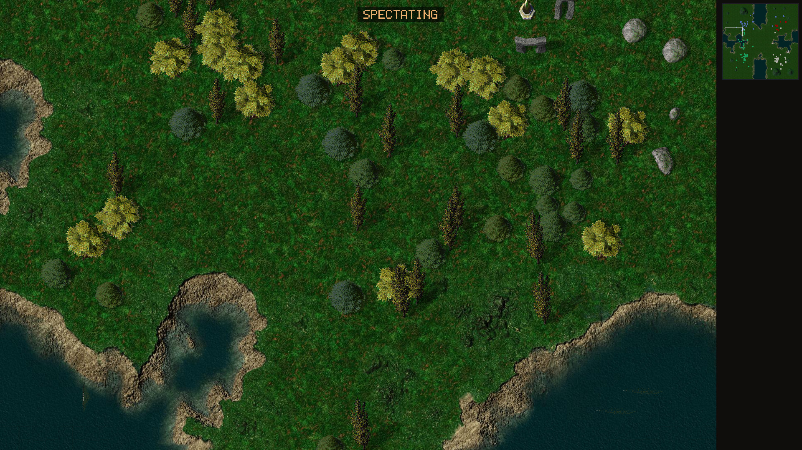

*Part of a generated Aramon Riverlands map.*

---

## Playing

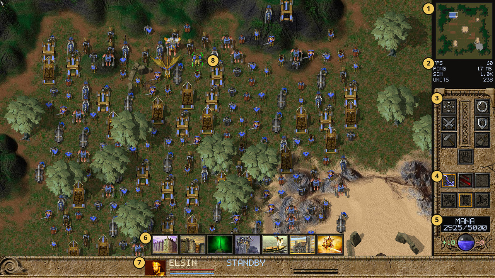

*The in-game screen with Aramon's Monarch, Elsin, selected.*

1. **Minimap.** Click or drag to move the camera.
2. **Stats panel** (optional; see [Interface](#interface)).
3. **Orders** for the selected units, such as move, attack, patrol, guard and stop.
4. **Weapons and stances** for the selected units.
5. **Mana**: your current mana and storage, with income and spending beside the orb.
6. **Build menu** of the selected builder or production building.
7. **Information bar**: the selected unit's portrait, name, health and what it is doing.
8. **The selected unit**, here the Monarch.

### The goal

In a normal skirmish, each player starts with **only their Monarch**. You build
an economy and an army from nothing. A player is out when they lose their Monarch
(unless **Monarch Expendable** is on) or when they have no units left. The last
team standing wins.

### Mana: the only resource

TA:K has a single resource, **mana**. Your current mana and storage are shown at
the top of the screen.

Mana comes from:

| Source | Income |
| --- | --- |
| **Your Monarch** | 10 mana per second, plus 5,000 storage. |
| **Lodestones** (Creon: Mana Refinery) built on mana spots | 10 mana per second each, plus storage. |
| **Divine lodestones** (Creon: Mana Amplifier) | 20 mana per second each, plus more storage. |
| **Builders and some priests** | A small trickle each. |
| **Reclaiming** trees, rocks and wrecks | A lump of mana per object. |

Mana spots are marked on the map. A lodestone must be built on one. Better spots
yield more.

**Upgrading lodestones.** A builder that offers your side's divine lodestone can
build it on top of one of your finished basic lodestones. The old one dissolves
during the first half of construction and the new one forms during the second.
The upgrade costs the full price of the divine lodestone, and the basic lodestone
is not refunded if you cancel.

**Spending.** Everything you build draws mana while it is being built. If income
cannot keep up, all construction slows down together. Storage lets you bank mana
for later.

**Personal mana.** Spellcasters, priests and the Monarch also have their **own**
mana pool, shown on the unit. Their spells and special abilities draw from it,
and it recharges over time.

**Allies.** Teammates can share surplus mana automatically. See
[Teams, allies and diplomacy](#teams-allies-and-diplomacy).

### Building

Select a builder and its build menu appears along the bottom of the screen.

- **Structures**: click an icon, then click the map to place it. Placement shows
  whether the spot is valid. Right-click or **Esc** cancels.
- **Lines and queues**: hold **Shift** while placing to queue several sites, or
  Shift-drag to lay a line of walls or towers.
- **Lodestone areas**: choose a lodestone, then **drag a box** over the map. The
  builder visits every free mana spot in the box, scouting unexplored ones first.
- **Assisting**: right-click an unfinished building with another builder to help
  build it.
- **Clearing the site**: a builder that can reclaim automatically clears trees
  and rocks from a valid building site before it starts. Units and solid
  obstacles still block placement.

**Training units at a building.** Select a production building and click its
build icons:

| Click | Effect |
| --- | --- |
| Left-click | queue one more |
| Shift + left-click | queue five more |
| Ctrl + Shift + left-click | queue ten more |
| Right-click (with the same modifiers) | remove one, five or ten |
| Ctrl + left-click | start or stop **infinite production** |

Each icon shows how many are queued. Give the building a **move** or **patrol**
order to set a **rally point** for new units; Shift adds more rally steps.

**Mobile production.** Some builders conjure units in the field (Zhon's Beast
Handler, for example). They place what they build like a structure. A mobile
builder running infinite production treats **Move** and **Patrol** as rally
orders for its output. **Stop** ends production.

The build menu only appears when exactly one builder or production building is
selected.

### Reclaiming

A builder that can reclaim turns trees, rocks and wrecks into mana.

- Right-click a single object to reclaim it.
- **Right-drag a box** to reclaim a whole area. The builder works through it,
  nearest first. Mana spots are left alone.

### Repairing and healing

Press **H** (or use the heal button) and click a damaged friendly unit or
building. Repair costs mana. Builders on **patrol** automatically repair damaged
friendly units and buildings near their route, then carry on patrolling.

### Your army

**Stances.** Every unit has a stance, set from the command panel:

| Stance | Behaviour |
| --- | --- |
| **Offensive** | Attacks enemies in range and chases them within limits. |
| **Defensive** | Fires at enemies in range but does not chase. |
| **Passive** | Does not attack on its own. |

New units take their type's default stance. Direct attack orders always work,
whatever the stance.

**Weapons.** Units with several weapons may switch between them. Press **W** to
cycle the active weapon.

**Veterancy.** Units gain experience by destroying enemies and grow stronger as
they rank up. Some units, such as Monarchs, never gain ranks.

**Status effects.** Some weapons and spells **petrify**, **freeze** or
**paralyse** their targets. Affected units cannot act until the effect wears off.

**Cloaking.** Units that can cloak turn invisible with **K**. Cloaking drains
mana while active.

**Gates.** Your gates open and close with **O**. Your own units can pass an open
gate.

**Self-destruct.** **Ctrl+Shift+D** starts a five-second self-destruct on the
selected units. Press it again to cancel.

### Air units

Flyers ignore terrain and walls, and set down on the ground when they land. A
landed flyer can be attacked by ground units and blocks ground movement. In **Legion** mode, flyers never land on top
of other flyers or ground units; in **Retail** mode they follow the original
game's rules, which sometimes let them overlap.

Flyers are much faster than most ground units. When you put flyers and ground
units in the same group or formation:

- In **Legion** mode, flyers in a formation hold their places over the ground
  units, keep to the army's pace, and settle over it when it arrives.
- In **Retail** mode, as in the original game, they are never slowed to the
  army's pace. A flyer that gets far out of place is sent back to the group,
  and a flyer that gets ahead of the group a second time has a one-in-four
  chance to drop all its orders and stop where it is.

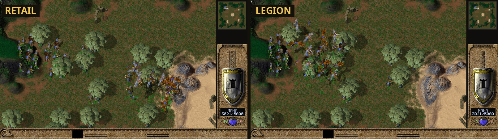

*The same formation of ground units and flyers 22 seconds after one move order. Left, Retail: the flyers have gone ahead. Right, Legion: they keep over the ground units. (A development scene.)*

### Ships and transports

Ships and hovercraft move on water; some hovercraft also cross land. Several
sides have **transports** (for example Aramon's Ark and Veruna's Transport Ship).

- **L** then click a transport loads the selected units into it.
- **U** then click a destination unloads them there.

### Gods

Each side has a god: an enormous unit that can decide a battle. It appears in
your **Monarch's build menu**, costs 360,000 mana and is limited to one at a
time.

In the original game, roughly one multiplayer game in ten was a "god game", in
which gods appeared on their own 30–60 minutes in. **TAK Engine does not make
gods appear by themselves in skirmish or multiplayer.** A god turning up
unannounced decided games for reasons neither player chose, so this was removed
on purpose. You can still conjure one if you can afford it.

The five dragons (one per side) and the Creon Aerial Juggernaut are also limited
to one at a time.

### Scoring

Destroying an enemy unit adds that unit's experience value to your score, as in
the original game. Building units and gathering mana do not score. The **F4**
panel shows each player's kills, losses and score.

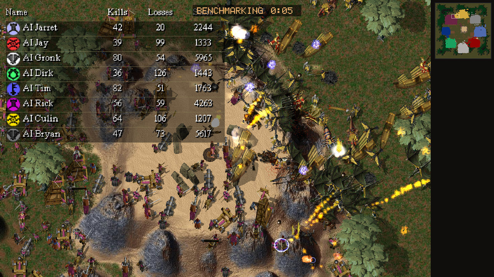

*The F4 scorecard during an eight-player benchmark battle.*

---

## The five sides

The original game has four kingdoms, and *Iron Plague* adds a fifth. Every side
follows the same basic plan (Monarch, lodestones, production, army), but each
plays very differently. The unit lists below come from the shipped game data and
are a selection, not a complete roster.

| Side | Monarch | Main production | Identity |
| --- | --- | --- | --- |
| **Aramon** | Elsin | Keep, Barracks | Knights, archers and siege engines |
| **Taros** | Lokken | Cabal, Abyss, Temple | Dark magic, demons and the undead |
| **Veruna** | Kirenna | Citadel, Enclave, Sea Fort | Gunpowder, crossbows and the strongest navy |
| **Zhon** | Thirsha | none: mobile conjurers | Beasts and wild magic |
| **Creon** | Sage | Smithy, Academy, Navy Yard | Engineering and machines (*Iron Plague*) |

All five Monarchs produce 10 mana per second and carry 5,000 mana storage.
Every side has a basic lodestone (10 mana/s) and a divine lodestone (20 mana/s),
and a senior builder (a priest, shaman or engineer) who builds the divine
lodestone and the side's most powerful units. Every side except Zhon also builds
walls and a gate.

### Aramon

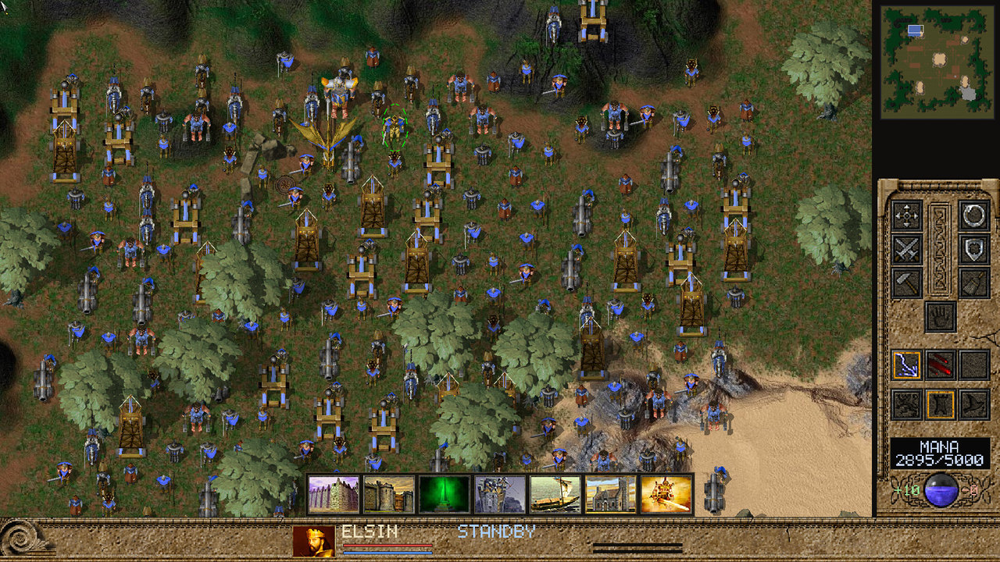

*Aramon: Elsin selected, with her build menu. The army is a test start, not a normal opening.*

The kingdom of knights and stone castles. Aramon fields solid infantry,
cavalry and powerful siege weapons.

- **Monarch: Elsin.** A sturdy fighter on foot. Builds the Barracks, lodestones,
  walls, gates, the Watch Tower and the Ark transport.
- **Economy and building.** The **Barracks** trains Swordsmen, Archers,
  Horsemen, Catapults, Spyhawk scouts and the **Mage Builder**. The Mage Builder
  (and the Flying Builder) raise the **Keep**, Stronghold, Trebuchet and the War
  Galley. The Keep trains the heavy units. The **Acolyte** builds the Divine
  Lodestone, the Grenadier, the Flying Builder and the Gold Dragon.
- **Notable units.** Knight, Mage Archer, Cannoneer, Titan, the Rolling Tower
  siege engine, the Assassin (can cloak), the Gold Dragon.
- **God: the Avatar of Anu.**

### Taros

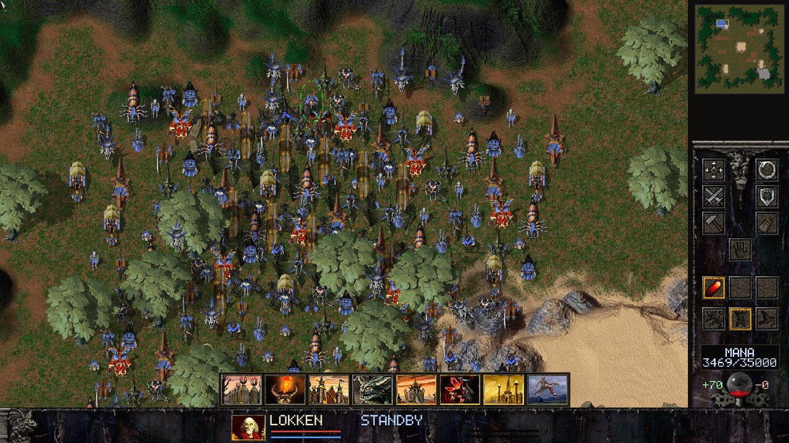

*Taros: Lokken and the Taros interface.*

A kingdom of necromancy, fire and demons, led by the sorcerer Lokken.

- **Monarch: Lokken.** A sorcerer who can cloak. Builds the Cabal, Abyss and
  Temple, lodestones, walls, a gate and the Caged Demon.
- **Economy and building.** The **Cabal** trains Zombies, Executioners, Black
  Knights, Gargoyles, Ghost Ships and the **Dark Mason** builder. The **Abyss**
  trains Skeleton Archers, Fire Demons, Iron Beaks, the Rictus, the Dark Hand and
  the Weather Witch. The **Temple** trains Blade Demons, Liches, Fire and Mind
  Mages, Sky Knights, Kamikaze Rats, Fire Spouts and the **Dark Priest**. The
  Dark Priest, which flies, builds the Divine Lodestone, the Fallen Angel and the
  Black Dragon.
- **Notable units.** Zombie (cheap and plentiful), Lich, Mind Mage, Kamikaze
  Rat (can cloak), Fallen Angel, Black Dragon.
- **God: the Spawn of Belial.**

### Veruna

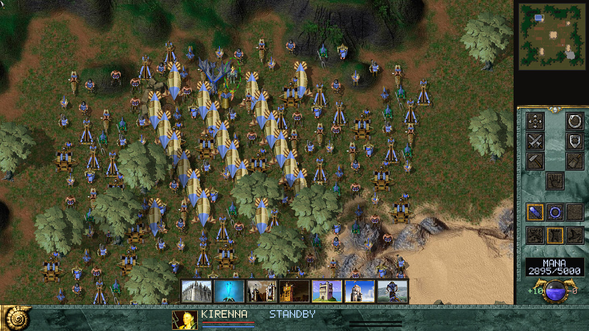

*Veruna: Kirenna, with Dirigibles over the army.*

A seafaring kingdom of gunpowder, crossbows and warships, ruled by the sorceress
Kirenna.

- **Monarch: Kirenna.** A hovering Monarch who crosses water. Builds the Enclave,
  Sea Fort, Guard Tower, lodestones, walls and a gate.
- **Economy and building.** The **Enclave** trains Warriors, Crossbowmen,
  Catapults, Parrots, Mer Warriors and the **Priestess** builder. The Priestess
  builds the **Citadel**, Sea Fort, Bastion, Lighthouse, Mortar and more. The
  Citadel trains Musketeers, Crusaders, Berserkers, Centaurs, Amazon Knights,
  Dirigibles and the **Priest of Lihr**, who builds the Divine Lodestone, the
  Ballista, the Pillar of Light and the Sea Dragon. The **Sea Fort** builds the
  navy: Skiffs, Harpoon Ships, the Man of War, the Trebuchet Ship, the Transport
  Ship and the **Flagship**, a ship that can build.
- **Notable units.** Musketeer, Amazon Knight, Man of War, Trebuchet Ship, the
  Sea Dragon.
- **God: the Angel of Lihr.**

### Zhon

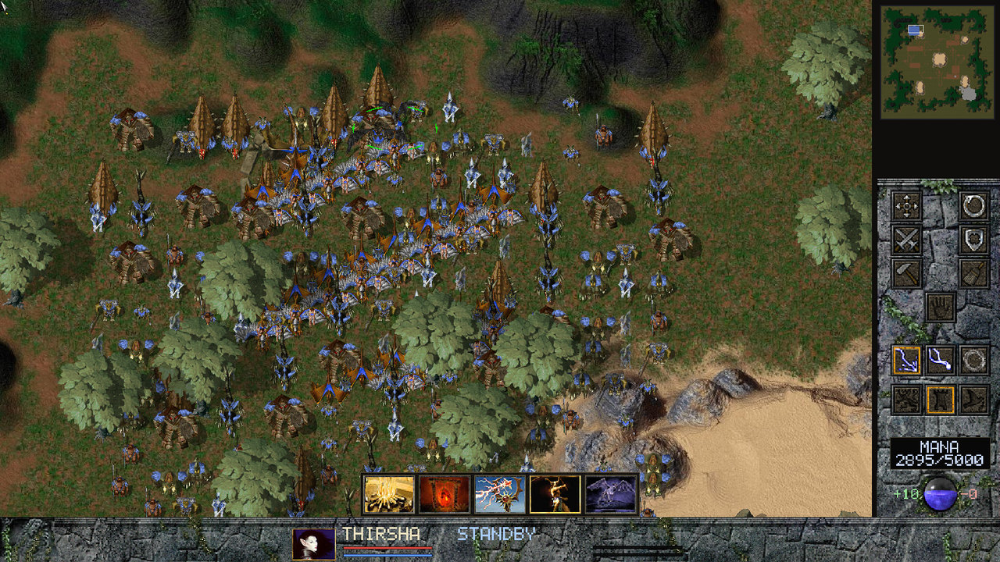

*Zhon: Thirsha. Her build menu holds conjurers and field structures, not production buildings.*

A wild kingdom of beasts and nature spirits, led by the huntress Thirsha.

Zhon has **no fixed production buildings**. Everything is conjured in the field
by mobile builders, so a Zhon base is wherever its conjurers stand.

- **Monarch: Thirsha.** She flies. Builds the Beast Handler, lodestones, the
  Sacred Fire and the Death Totem.
- **Economy and building.** The **Beast Handler** conjures Goblins, Trolls,
  Hunters, Bats, Swamp Beasts, lodestones and the **Beast Tamer**. The Beast
  Tamer conjures Spirit Wolves, Basilisks, Gryphons, Harpies, the Kraken and the
  **Beast Lord**. The Beast Lord conjures Jungle Orcs, Stone Giants, Rocs,
  Drakes, Wisps and the **Shaman**, who conjures the Divine Lodestone, the Giant
  Orm, the Giant Barracuda and the Ancient Dragon.
- **Notable units.** Troll, Basilisk (its gaze turns enemies to stone), Stone
  Giant, the Trapdoor Spider (can cloak), the Ancient Dragon.
- **God: the Wrath of Tammuz.**

### Creon

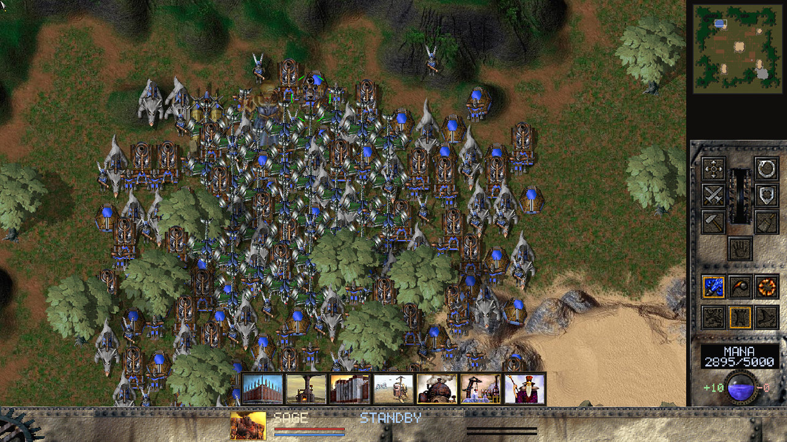

*Creon: the Sage and the Creon interface.*

The fifth side, added by *Iron Plague*: a nation of engineers and steam-driven
machines.

**Creon needs the Iron Plague archives** (`IPData.hpi` and its companions) in
your install folder. The engine finds them automatically; there is no setting to
enable. Without them the Creon side has no units, so a Creon player would start
with nothing. Do not pick Creon, or let a random AI side be chosen, if Iron
Plague is not installed.

- **Monarch: the Sage.** Builds the Smithy, Navy Yard, Mana Refinery, Gatling
  Crossbow, walls and a gate.
- **Economy and building.** Creon's lodestones are the **Mana Refinery** and the
  **Mana Amplifier**. The **Smithy** trains Automatons, Barnstormers, Fire
  Wagons, Tortoises and the **Mechanic** builder. The Mechanic builds the
  **Academy**, Bomb Sprinkler, Prismatic Mirror and more. The Academy trains
  Beast Riders, Shock Troopers, Neo Dragons and the **Chief Engineer**, who
  builds the Mana Amplifier and the **Aerial Juggernaut**. The **Navy Yard**
  builds the Iron Clad, Stern Wheeler and Submersible.
- **Notable units.** Shock Trooper, Fire Wagon, Iron Clad, Submersible, the
  Aerial Juggernaut (one at a time).
- **God: the Ghost of Garacaius.**

Creon is fully playable in skirmish and multiplayer, and the AI can play it. It
appears in the side picker and in the random map generator's world choices. The
Crusades balance includes its own Creon unit definitions but leaves Creon's
build menus unchanged.

---

## Controls

These are the default bindings. Command, selection, view and emote keys can be
changed in **Settings → Controls**: click a row and press the new key;
right-click a row to unbind it. Number-key squads, **Esc**, chat, pause and game
speed keys are fixed.

### Mouse

| Input | Action |
| --- | --- |
| **Left-click** | Select a unit. |
| **Left-drag** | Box-select. |
| **Shift** + select | Add to the selection. |
| **Ctrl** + select | Remove from the selection. |
| **Right-click** | The natural order for what is under the cursor: move, attack, guard, repair, load, reclaim and so on. |
| **Shift + right-click** | Queue that order after the current ones. |
| **Right-drag** with a reclaiming builder | Reclaim everything in the box. |
| **Middle-drag**, or the cursor at a screen edge | Scroll the map. |
| **Mouse wheel** | Zoom in and out, towards the cursor. Far out, **Options → Tactical Dots** can draw units as minimap-style dots. |
| **Minimap left-click / drag** | Move the camera. With an order armed, issue it there instead. |
| **Minimap right-click** | Move the selection there. Shift queues it. |
| **Right-click a cycling setting** | Go back one choice (left-click goes forward). Works in menus and options. |

### Orders

Orders that need a target are **armed** by their key or button, then issued with
a left-click on the map or minimap. **Esc** disarms.

| Key | Order |
| --- | --- |
| **M** | Move. |
| **A** | Attack. Click an enemy, or click the ground to fight-move there. |
| **F** | Fight-move: move, attacking enemies met on the way. |
| **P** | Patrol. |
| **G** | Guard a unit or building. |
| **H** | Heal or repair a friendly unit or building. |
| **L** / **U** | Load into a transport / unload at a destination. |
| **S** | Stop: cancel all orders. |
| **C** | Clear orders. |
| **W** | Cycle the active weapon. |
| **K** | Toggle cloak. |
| **O** | Open or close selected gates. With nothing selected, show campaign objectives. |
| **D** | Diplomacy: give units, share mana, choose chat recipients. |
| **Ctrl+Shift+D** | Self-destruct (again to cancel). |

### Selection

| Key | Selects |
| --- | --- |
| **Ctrl+A** | All your units. |
| **Ctrl+Z** | All your units of the types already selected. |
| **Ctrl+U** | All your units on screen. |
| **Ctrl+X** | On-screen units of the first selected unit's type. |
| **Ctrl+M** | Your Monarch, and follow it with the camera. |
| **Ctrl+B** | Builders. |
| **Ctrl+F** | Production buildings. |
| **Ctrl+E** | Melee units. |
| **Ctrl+G** | Spellcasters with their own mana. |
| **Ctrl+N** | Ships and water units. |
| **Ctrl+R** | Units with ballistic weapons. |
| **Ctrl+T** | Armed troops (not ships or Monarchs). |
| **Ctrl+W** | All armed units except Monarchs. |
| **Ctrl+Y** | Flyers. |
| **N** | Next unit. |

### Groups and formations

| Key | Action |
| --- | --- |
| **Ctrl+1** … **Ctrl+0** | Make the selection a **group**. |
| **Alt+1** … **Alt+0** | Make the selection a **formation**. |
| **Ctrl+Shift+number** / **Alt+Shift+number** | Add the selection to a group or formation. |
| **1** … **0** | Select that group or formation. Press again to centre the camera on it. |
| **Ctrl+Esc** | Remove the selected units from their group or formation. |

A unit belongs to one group or formation at a time. Each unit shows its number
under it: `3` for group 3, `3F` for formation 3.

- A **group** is a saved selection.
- A **formation** also travels together: it moves at the pace of its slowest
  member, and members that fall far behind rejoin once the formation has stopped.

Recalling a group skips its builders, but units those builders produce join the
group automatically.

### Camera and information

| Key | Action |
| --- | --- |
| **Arrow keys** | Scroll the map. |
| **T** | Follow the selection with the camera. |
| **Tab** | Full-screen map. Press again to return. |
| **Shift+Z** | Return to the original game's 1:1 zoom. |
| **F1** | Unit information for the selected unit. |
| **F4** | Player names, kills, losses and score. |
| **F9** | YouTube streaming setup. |
| **Pause** | Pause or resume. This pauses the game for every player. |
| **+** / **−** | Game speed, 0.5× to 8× in 0.5× steps. Only the host can change it, and only if **Allow speed change** was on. |
| **Enter** | Open chat; **Enter** sends, **Esc** cancels. |
| **Esc** | Close a dialog, cancel placement or an armed order, clear the selection, then open the game menu. |

### Emotes

| Key | Action |
| --- | --- |
| **Shift+D** | Disco: the selected units (or your Monarch) dance for ten seconds. |
| **Shift+H** | Headbang: the selected units (or your Monarch) headbang for ten seconds. |

Everyone in the game sees and hears emotes.

---

## Queueing orders with Shift

Hold **Shift** to add an order to the end of a unit's list instead of replacing
it. This works for **every** order: move, attack, fight-move, patrol, guard,
repair, reclaim, area reclaim, load, unload and building.

- **Right-click with Shift** queues the natural order.
- **Armed orders stay armed while you hold Shift.** Press **M**, **F**, **P**
  and so on, then Shift-click as many points as you like. Releasing Shift
  disarms the order.
- Units carry out their list in order. A finished order hands over to the next
  one straight away.
- **Hold Shift to see the plan.** The selected units show a dotted line through
  their queued orders, including building sites and area jobs.
- **Stop** (**S**) clears the whole list.

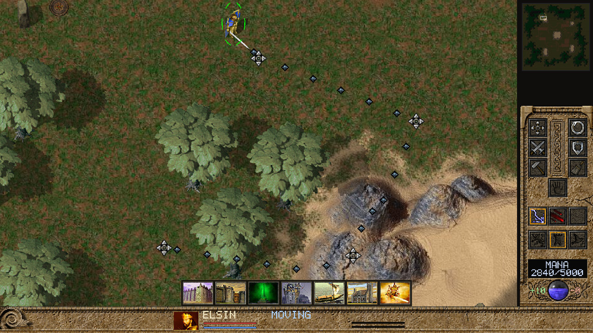

*Holding Shift shows the queued route: one move, then three Shift-queued moves.*

**Patrols loop.** Patrol points keep cycling; other orders run once.

| You issue | The unit does |
| --- | --- |
| Shift-patrol B, then Shift-patrol C, from standing still | Patrols start → B → C → start, forever. |
| Move to A, then Shift-patrol B | Walks to A, then patrols A ↔ B. |
| Patrol B, then Shift-patrol C | Adds C to the existing patrol loop. |
| Move A, Shift-move B, Shift-move C | Visits A, B and C once each, then stops. |

**Production buildings** take Shift-queued rally orders the same way.

In **Legion** mode, a group's queued moves are planned for the group as a whole,
just like its first move.

---

## Pathfinding: Retail and Legion

The game creator chooses how units find their way, in **Pathfinding** on the
game setup screen. Everyone in the match uses the same choice. Campaigns always
use Retail.

### Retail (the default)

Retail reproduces the original game's movement as exactly as possible: how units
search for routes, how they bump and wait, how groups pace themselves, and how
flyers take off and land. Its behaviour has been checked routine by routine
against the original game.

Choose Retail if you want the game as it was, including its well-known quirks:
long single-file columns, units jostling at chokepoints, and units occasionally
circling when stuck.

In Retail, groups and formations keep together the original way: members move at
the slowest member's speed, a member that falls far behind slows the group
instead of sprinting, and members far from the group walk back or wait.

### Legion

Legion is a movement system written for TAK Engine. It is designed for big
armies:

- **Groups plan together.** A group's order is planned once for the whole group,
  and the group heads for the destination as a body, not as a column of
  individuals.
- **Arrivals settle.** Units take up places around the destination point, and
  once they are close they stop. Large groups do not keep shuffling forever.
- **Wheeling round walls.** When a large group (16 or more) goes round the end of
  a wall, it swings round in several ranks instead of narrowing to single file.
  It drops to single file only when the gap really is too narrow.
- **Going round obstacles.** Groups route round parked crowds of units and round
  landed flyers instead of pushing into them. Your own idle units step aside to
  let a group through.
- **No spinning.** A unit that is truly trapped stops and waits, instead of
  circling on the spot. Units are not caught on jagged terrain unless they really
  are boxed in.
- **Followers keep pace.** Units following others in a stream match their speed
  instead of stop-starting.
- **Flyers land cleanly.** Flyers never land on top of other flyers or ground
  units.
- **Flyers stay with the army.** Flyers in a formation with ground units hold
  places over the ground units and keep to their pace, instead of racing
  ahead and waiting at the destination.

Legion handles ground units, ships and hovercraft for moves, fight-moves,
patrols, attacks, guarding, building, repairing, reclaiming and transport
orders. Flyers in flight use the original game's movement, except that flyers
in a formation with ground units keep station over them.

**Known limits of Legion:**

- A large group sent into a **dead-end corridor** can leave some units
  unsettled at the far end.
- A crowd that parks **after** a group has already planned its route is not
  avoided until the group's next order.
- When a group goes round a parked crowd, it can still pass by one side in a
  narrow file.
- Idle units of **other players** do not step aside for you.
- A ground unit can still walk in under a flyer that is coming down to land.
- With thousands of units, Legion uses more processor time than Retail.

### Which should I choose?

| If you want | Choose |
| --- | --- |
| The original game's movement, exactly | **Retail** |
| Large armies that move and arrive cleanly | **Legion** |
| A campaign | Retail is always used |

---

## Options

Open **Options** from **Settings** on the main menu, or **Esc → Options** in a
game. Changes apply immediately; **Save** keeps them.

### Player

| Option | Default | What it does |
| --- | --- | --- |
| **Player name** | blank | Your name in local and unauthenticated games. Signed-in multiplayer uses your account name. |

### Audio

| Option | Default | What it does |
| --- | --- | --- |
| **Sound device** | System default | The output device. You can switch while playing. |
| **Master volume** | 100% | Overall volume. |
| **Music volume** | 50% | Soundtrack volume. |
| **Sound effects** | 100% | Unit, world and interface sounds. |
| **Speaker** sliders | 100% | One per speaker channel on your device, for surround setups. |

World sounds are full volume on screen and fade with distance off screen.

### Display

| Option | Default | What it does |
| --- | --- | --- |
| **Fullscreen** | On | Borderless fullscreen. |
| **VSync** | On | Match the frame rate to the display. |
| **Max FPS** | 60 | Frame-rate cap when VSync is off (30–240). |

### Graphics

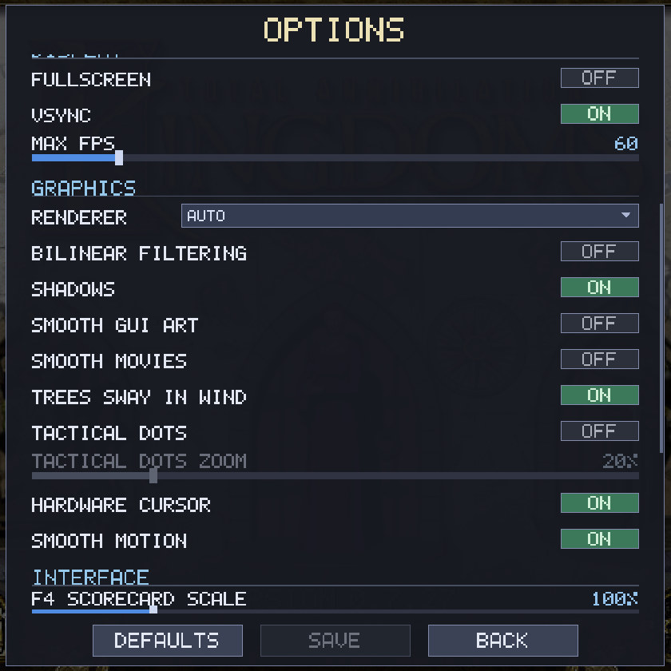

*Options, Graphics section, at the default settings. Tactical Dots Zoom is greyed out because Tactical Dots is off. The picture was taken in a window, so Fullscreen above shows Off.*

| Option | Default | What it does |
| --- | --- | --- |
| **Renderer** | Auto | Which graphics backend draws the game. Takes effect after a restart; see [Renderer](#renderer). |
| **Bilinear Filtering** | Off | The original game's option. Smooths unit textures and unit shadows. Terrain, scenery and the interface stay sharp, as in the original. |
| **Shadows** | On | Unit, scenery and projectile shadows. The biggest single graphics cost in a crowded battle. |
| **Smooth GUI Art** | Off | Sharpens the low-resolution interface art, menus, fonts and cursors with an edge-aware upscale. No cost per frame; uses more video memory. |
| **Smooth Movies** | Off | Removes the blocky compression artefacts from the game's movies. |
| **Trees Sway in Wind** | On | Animated trees and their shadows. |
| **Tactical Dots** | Off | Zoomed far out, every unit is drawn as a dot in its player's colour, like the minimap, instead of its model. Not in the original game. See below. |
| **Tactical Dots Zoom** | 20% | How far out you must zoom before dots replace models. Greyed out while Tactical Dots is off. See below. |
| **Hardware Cursor** | On | The operating system draws the cursor, so it stays smooth even if the game stutters. |
| **Smooth Motion** | On | Units glide between the game's 30 updates per second instead of stepping. Adds about 33 ms of visual delay. |

**Tactical Dots Zoom** sets when dots take over; it is greyed out and cannot be
changed while Tactical Dots is off. It is a position along your zoom-out range:
at **0%** dots appear only when you are zoomed all the way out;
at **100%** they appear from normal size (100% zoom) outwards; the default
**20%** means the most zoomed-out fifth of that range. The range is measured in
mouse-wheel notches, so each notch moves the same share of it. It is relative
because how far you can zoom out depends on your window and the map: the view
stops where the map fills the window, which on a very wide screen is close to
normal size. Once dots are showing, the models come back only after you zoom
in a little more than one wheel notch past the setting, so the view never
flickers between the two at the boundary. Dots follow the
minimap's rules exactly: enemies show only where you can currently see them.
Buildings are bigger squares than soldiers, flyers sit at their flying height,
and selected units get a white outline. Click and box selection work on the
dots. Health bars, production bars and unit shadows are hidden while dots are
showing; trees, terrain, projectiles and explosions are drawn as normal. Dots
are much cheaper to draw than models, so a huge zoomed-out battle also runs
faster.


*The same moment of an eight-AI Benchmark battle on Ulasem Arena, zoomed far out
in a 1920 × 1080 window with Tactical Dots Zoom at its default 20%. Left, Tactical
Dots off; right, on. Trees, terrain and the blue spell effect are drawn either
way.*

#### Renderer

**Auto** lets the game pick the graphics backend, as every earlier version did:
OpenGL on Linux, Direct3D on Windows and Metal on macOS. The list also shows
every other backend your copy of the game can use, such as **OpenGL ES 2**,
**OpenGL ES**, **Direct3D 11**, **Direct3D 12** or **Software**; only the ones
available on your system appear.

- Leave it on **Auto** unless something is wrong. Try another backend if the
  game draws incorrectly, crashes in the graphics driver, or runs badly on your
  graphics card; on Windows, Direct3D 11 or OpenGL are the usual alternatives.
- **Software** draws everything on the processor without the graphics card. It
  is a last resort for a machine with no working graphics driver: it is very
  slow at high resolutions (a few frames per second at 1920x1080 in a big
  battle), and Bilinear Filtering has no effect on units with it.
- The change takes effect the next time the game starts. Until then the row
  says **RESTART REQUIRED**.
- If the chosen backend is missing or fails to start, the game uses **Auto** for
  that session and says so at the top of the main menu (and the row says
  **UNAVAILABLE**). Your choice stays saved, so it is tried again next time;
  pick **Auto** to stop the message.
- The Benchmark results and the Stats panel show the backend in use.

### Interface

| Option | Default | What it does |
| --- | --- | --- |
| **F4 Scorecard Scale** | 100% | Size of the F4 player panel (75–200%). |
| **UI Scale** | 100% | Size of the in-game interface (75–200%). |
| **Health Bars** | Damaged | Off, only on damaged units, or always. |
| **Stats Panel** | On | Live statistics in the space under the minimap. |
| **Build Menu** | Center | Where the build icons sit: left, centre or right. |
| **Build Menu Scale** | 100% | Extra size for the build icons (75–400%). |

The **stats panel** shows your units, kills and score, the clock, real time,
game time, client and server processor use and GPU use. It drops rows when there
is not enough room.

### Camera

| Option | Default | What it does |
| --- | --- | --- |
| **Mouse Zoom Speed** | 1× | Wheel zoom speed. |
| **Edge Scrolling** | On | Scroll when the cursor touches a screen edge. |
| **Edge Scroll Speed** | 1× | Edge scrolling speed. |
| **Cursor Size** | 1× | Cursor size, 1× (the original size) to 8×. |

Key bindings are under **Settings → Controls**.

---

## Multiplayer

Multiplayer uses a **server**. Every player connects out to the server, so
players do not need to open ports or set up their routers. The server runs the
game alongside the players, hosts the computer opponents and checks that every
player's game stays in step.

### Joining a game

1. Click the **Multiplayer** door.
2. Choose a server, or enter its address.
3. Enter an **account name** and **password**. A name the server has not seen
   before is registered the first time you sign in.
4. In the game browser, **create** a game or **join** one. Password-protected
   games ask for the password.
5. In the room, choose your side, colour and team, then click **Ready**. The host
   starts the game when everyone is ready.


*A game room, here for a single-player game: player and AI slots, override packs and the read-only match rules.*

The host can open and close slots, add AIs and kick players. Match options are
set when the game is created; see [Match options](#match-options).

### Maps and content

If you do not have the selected map, it is **downloaded automatically** before
the game starts. Downloaded and generated maps stay in your map list. See
[map sharing](map-transfer.md).

Everyone must have the **same base game data**. The server compares the game's
unit, weapon and build definitions when you join and turns away a mismatched
install.

### Teams, allies and diplomacy

Up to eight players can play, on up to eight teams. Allies share vision
automatically.

Press **D** for the **Diplomacy** screen:

- **Give units**: hand your selected units to an ally.
- **Share mana**: choose which teammates receive your surplus mana. Surplus goes
  first to the ally whose storage is least full. Sharing starts on for
  teammates.
- **Chat recipients**: choose who receives your chat messages.

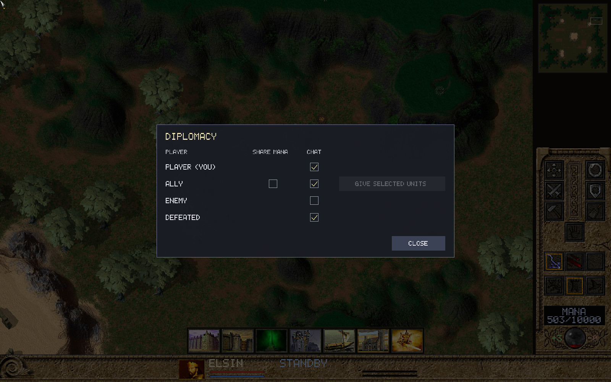

*The Diplomacy screen (**D**), from the engine's built-in input test.*

See [unit gifting](unit-gifting.md) for which units can be given.

### Spectating

Click **Watch** on a running game in the browser to watch it live. Spectators
see the whole map without fog and cannot give orders.

### Disconnects

If you drop out of a game, your slot is held and the game pauses for up to five
minutes so you can reconnect and catch up. If you do not return, you forfeit.

### Versions

**Everyone must use the same version of TAK Engine**, client and server alike.
Version 0.7.27 uses network protocol **238**. Older and newer versions cannot
play together, and the server turns away a mismatched client.

If players' games ever fall out of step (a "desync"), the server detects it.
This should not happen between matching versions with matching game data; if it
does, please report it with the replay.

### Network use

The game sends orders, not unit positions, so it needs very little bandwidth:
about 0.5 KB/s per player plus a few bytes per order. Low latency and low packet
loss matter more than raw speed. The [README](../README.md#multiplayer-and-replays)
has the details.

---

## Campaigns

Click the **Campaign** door to open the campaign book. Two campaigns are
available if your install has their data:

| Campaign | Missions | Needs |
| --- | --- | --- |
| **The Book of Darien** | 48 | the base game (`missions.hpi`) |
| **The Iron Plague** | 25, with an alternate ending | *Iron Plague* (`IPMissions.hpi`) |

In the book:

- Choose a campaign tab, then use the page arrows, **Left/Right** or
  **Page Up/Page Down** to browse chapters.
- **Home/End** jumps to the first or last chapter. **Tab** switches campaigns.
- **Enter** plays the selected chapter. **Escape** returns to the menu.
- Every chapter can be selected, including the *Iron Plague* alternate ending.


*The campaign book, with tabs for both campaigns at the bottom.*

Each mission plays its intro movie, then shows the briefing over the paused
battlefield. **Enter**, **Space**, **Escape** or a left click starts the
mission. The mouse wheel and **Up/Down** scroll long briefings. During play,
**O** (with nothing selected) shows the objectives.

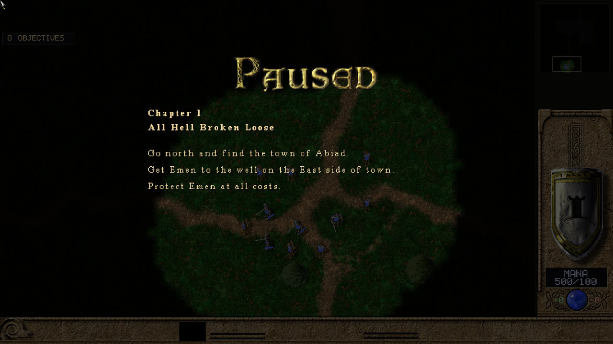

*The briefing for *Book of Darien* chapter 1, over the paused battlefield.*

When you win, **Next** goes to the next chapter and **Retry** replays this one.
Campaigns always use Retail pathfinding.

Mission scripting is reproduced from the original game, but individual missions
may still have problems. See the [campaign notes](campaign-design.md).

---

## Replays

Every game you play or watch is **recorded automatically**, including games where
you only spectate the AI (the Benchmark is not recorded). Replays of games you
watched carry no checkpoint hashes, since a spectator does not report them.

To watch one, open **Settings → Load Replay** on the main menu and choose a
recording. During playback:

- **Pause** pauses and resumes.
- **+** / **−** change playback speed.
- The time bar shows elapsed and total time.

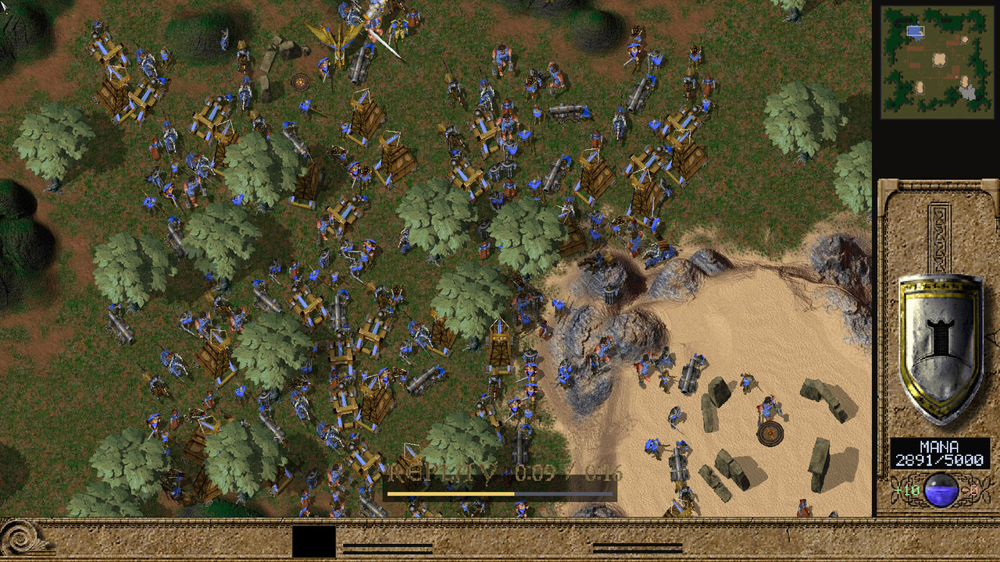

*Replay playback, with the time bar near the bottom.*

A replay stores the match setup and every order, not the game art, so it is
small. Playback needs:

- **the same version of TAK Engine** that recorded it (0.7.27 plays protocol-238
  recordings);
- the same game data and map.

Older recordings need the engine version that made them. Keep an old copy of the
engine if you want to keep watching old replays.

Replays are saved beside your settings file; see
[Where files are kept](#where-files-are-kept). A server can also keep finished
games, if its operator turns that on.

---

## Overrides

Override packs replace game files: new sounds, textures, interface art, or, in
**Full** mode, new units and rules.

Put each pack in its own folder inside `overrides/` in your install folder, for
example `overrides/New Sounds/sounds/click.wav`. A pack can hold loose files or
`.hpi`, `.ufo` and `.kmp` archives. **Files placed directly in `overrides/` are
never loaded.**

The game creator picks the override mode on the setup screen:

| Mode | What packs may change |
| --- | --- |
| **Off** | Nothing. No packs are loaded. |
| **Cosmetic** | Textures, sprites, sounds, music, fonts and interface art. |
| **Full** | Everything, including units, weapons, build menus, maps, scripts and models. |

In the lobby, players tick the packs they want (up to 64). Packs load in
alphabetical order of their folder names; later names win when they change the
same file.

- In **Cosmetic** mode, each player chooses their own packs; they change only
  what that player sees and hears.
- In **Full** mode, the host's packs are sent to the server and to every player
  automatically, and everyone checks they have the same package before the game
  starts. Transfers are limited to 256 MB.
- Campaigns always use the original game data.

---

## Map editor


*Cartographer's Units browser, map canvas and minimap.*

**Cartographer** is TAK Engine's map and scenario editor. Launch it from its
application shortcut. It uses the same data folder as the game.

### Basics

- **File** offers New, Open (with recent maps), Save and Save As.
  **Ctrl+S** saves a playable `.kmp` map; **Ctrl+Shift+S** is Save As.
- Search the **terrain**, **feature** and **unit** browsers to find things to
  place. Unit rows show build portraits and names.
- **Place**, **Select**, **Erase** and **Pan** are separate tools. Right-drag
  pans.
- Select objects to move, copy, paste, duplicate, delete or edit their
  properties.
- **Ctrl+Z** / **Ctrl+Y** undo and redo. The editor keeps recovery copies, and
  saving keeps the previous version as a `.bak` file.
- **View** has a minimap, Fit Map, Frame Selection, layer visibility and
  overlays for movement, buildability, water and slope.
- **F6** opens a rotating 3D preview of the selected unit.

### Scenarios

- The **Regions** tool draws named trigger areas on the map.
- **T** opens scenario scripting: rules that run actions when their conditions
  are met. **Templates** inserts ready-made rules for common objectives
  (timed victory, reaching an area, elimination, reinforcements and more).
- **Scenario → Placed units** finds placed units by name, type or owner.
- **Scenario → Check Map** lists problems: unreachable starts or mana spots,
  isolated areas, missing resources, and scenario errors. Click a result to go
  to it.

See [scenario runtime details and limits](crt-triggers.md) before sharing a
scenario.

### Testing a map

Press **F5** (**Test Map**) to open the current map in a private game lobby.
Seat the players your scenario uses and start; the editor stays open with your
unsaved work. Close the game to return to editing. An authored scenario can
start with one player; an ordinary skirmish map needs two.

Turn on **Scenario → Log Test Map triggers** before pressing F5 to record which
rules fired. The launch message shows where the log is saved.

The game itself can also open a Cartographer snapshot directly with
`--play-map` (see [Command line](#command-line)); Cartographer does this for you
when you press F5.

See [the Cartographer progress notes](cartographer-improvements-progress.md)
for remaining limitations.

---

## Running a server

You only need your own server to host private online games; single-player starts
one for you automatically.

The Linux packages include the `takserver` dedicated server and a systemd
service with automatic Let's Encrypt certificates. The
[README's Linux server setup](../README.md#linux-server-setup) walks through
installing it step by step. In short:

- The server needs a copy of the **same retail game data** the players use.
- Players connect to TCP port **7677** by default. Port 80 is used briefly for
  certificate validation.
- Players sign in with accounts, which register themselves on first sign-in.
- `takserver --status` on the server machine prints how many games and players
  are active.

See [public server deployment](public-server.md) for manual certificates,
resource limits, upgrades and troubleshooting.

**Upgrade the server and players together.** A server only accepts clients of
the same protocol version.

---

## Benchmark

**Settings → Benchmark** runs a repeatable stress test: an eight-AI battle on
Ulasem Arena for 60 seconds of game time. Choose an **intensity**:

| Intensity | New units per side |
| --- | --- |
| Low | every second |
| Medium | every 0.5 s |
| High | every 0.25 s |
| Very High | every 0.125 s |
| Absurd | every 0.0625 s |
| Extra Absurd | every 0.03125 s |

The results screen shows, every ten seconds, frame rate, simulation speed,
processor use, memory, GPU use and video memory, together with the display
settings used. Unit limits still apply, so the highest intensities may not
reach their requested unit counts. A slow machine can take longer than 60 real
seconds.

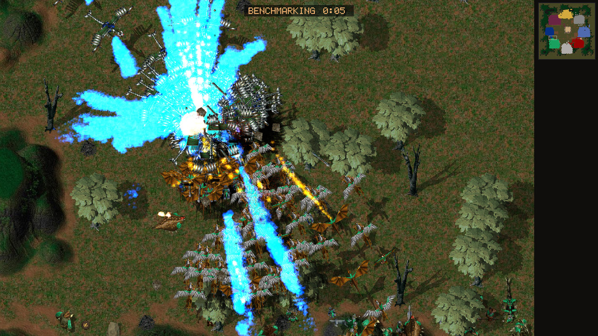

*A benchmark run at Absurd intensity, 55 seconds in. The badge at the top counts down the time remaining.*

---

## Troubleshooting and FAQ

### The game cannot find my game data

- Choose the folder that contains `data.hpi`, `terrain.hpi`, `sections.hpi` and
  `maps.hpi`, not a parent or child folder.
- If the game says core data is unreadable, the archives may be damaged; copy
  them again from your original installation.
- On Linux with no folder picker, install `kdialog` or `zenity`, or start the
  game with `--data /path/to/install`.

### Creon is missing or a Creon player starts with nothing

Creon needs the *Iron Plague* archives (`IPData.hpi` and the other `IP*.hpi`
files) in your install folder. See [Creon](#creon).

### The game is slow or stutters

- Leave **Smooth Motion** on; it makes movement look smooth at any frame rate.
- Turn **Shadows** off. It is the largest graphics cost in big battles.
- Leave **Hardware Cursor** on so the pointer stays responsive.
- Very large armies are expensive at high game speeds. Speeds above 1× are mostly
  for testing.
- In Legion mode, armies of several thousand units cost more processor time than
  in Retail.
- The **Benchmark** gives comparable numbers if you want to measure a change.

### The whole screen flickers on a large display

On very high resolutions, especially with KDE on Wayland, whole-screen flicker
usually means the graphics card has run out of video memory and the desktop
itself is being starved. TAK Engine caps and backs off its own video-memory use
to avoid this. If it still happens:

- close other programs that use the GPU heavily;
- turn **Smooth GUI Art** off and **Shadows** off;
- use a lower resolution.

### The game will not start, or shows a black screen

If this started after you changed **Options → Graphics → Renderer**, set it back
to Auto by hand: close the game, open `settings.ini` (see
[Where files are kept](#where-files-are-kept)) in a text editor, and change the
line `renderer = ...` to

```
renderer = auto
```

(deleting the line works too). The game also falls back to Auto by itself when a
backend cannot start at all; editing the file is only needed when the backend
starts but then misbehaves.

### There is no sound, or sound comes from the wrong device

Choose the device under **Options → Audio → Sound device**. If a saved device is
unplugged, the game falls back to the system default.

### I cannot join a multiplayer game

- Check that you and the server run the **same version**.
- Check that you have the same base game data as the server.
- Map downloads are automatic; wait for the map to verify in the lobby.

### My old replays will not play

Replays only play on the engine version that recorded them. See
[Replays](#replays).

### Where files are kept

Settings, saved replays and downloaded content live in a per-user folder:

| System | Folder |
| --- | --- |
| Windows | `%APPDATA%\TAKengine\TAKingdoms\` |
| macOS | `~/Library/Application Support/TAKengine/TAKingdoms/` |
| Linux | `~/.local/share/TAKengine/TAKingdoms/` |

The settings file is `settings.ini`. Replays (`.takrep` files) are saved beside
it. Cartographer keeps its preferences in a sibling `Cartographer` folder.

The game prints diagnostic messages to the terminal it was started from. On
Linux and macOS, start it from a terminal if you need them for a bug report.

### Command line

Released builds keep the command line deliberately small:

| Option | Effect |
| --- | --- |
| `--data <folder>` | Use this game-data folder. Optional: without it, the game uses the saved folder or asks. |
| `--play-map <map.kmp>` | Open a Cartographer map snapshot in a private game lobby. |
| `--version` | Print the version and exit. |

Everything else is set in the menus. Developer builds have many more options;
see the [development guide](development.md).

---

## Differences from the original game

TAK Engine follows the original game closely. These are the deliberate
differences:

- **Modern platforms**: any resolution, UI scaling, borderless fullscreen,
  hardware cursor and smooth motion between game updates.
- **Client-server multiplayer** with accounts, spectators, reconnecting,
  automatic map transfer and up to eight players.
- **Gods do not appear on their own** in skirmish or multiplayer. They can still
  be conjured.
- **Legion pathfinding** is available as an alternative; Retail remains the
  default and reproduces the original.
- **Builders clear their own building sites** of trees and rocks, and can build
  lodestones over a whole area at once.
- **Patrolling builders repair** nearby friendly units.
- **Area reclaim** with a right-drag box.
- **Mana sharing and unit gifting** between allies through the Diplomacy screen.
- **Sound fades with distance** from the camera instead of using one off-screen
  volume.
- **Boat shadows** and shadows on every lodestone.
- **A random map generator**, a modern map editor and **override packs**.
- **Emotes** (Disco and Headbang).

Everything else, such as unit statistics, weapons, the economy, the AI's
choices and the campaign scripts, aims to behave as it did in 1999. If you find
a difference that is not listed here, it is probably a bug. Please report it.
